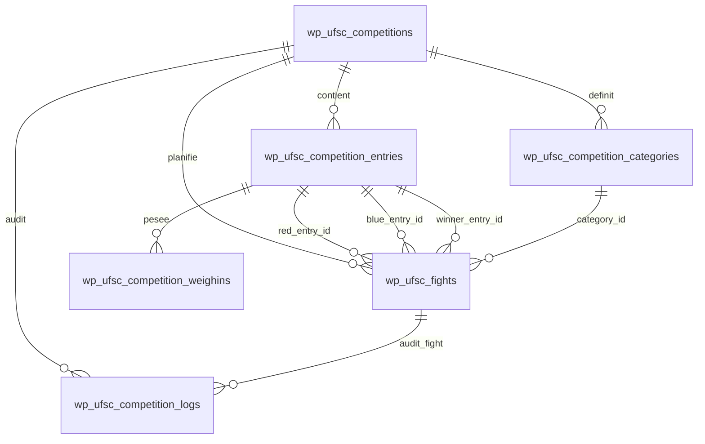

# Audit Lot 1 — Génération des combats, impressions et résultats

> Audit ciblé réalisé en lecture seule du code du plugin WordPress UFSC Licence & Compétition. Aucune génération réelle, aucune insertion SQL, aucune modification de données métier et aucune migration n'ont été exécutées.

## 1. Résumé exécutif
- État général de la partie compétition : le périmètre compétition est avancé et dispose déjà d'un workflow de brouillon pour la génération automatique, d'une page combats, d'une page d'impression, d'une vue plateau et de services de résultats.
- Niveau de risque global : **Élevé à Critique** tant que les actions sensibles ne sont pas toutes concentrées dans des services métier verrouillés et testées sur compétitions `[TEST]` uniquement.
- Ce qui fonctionne déjà : prévisualisation de génération, sélection d'éligibilité, stockage de brouillon, validation avec snapshot, actions admin protégées par nonces, impressions HTML, saisie/correction/verrouillage de résultats.
- Ce qui est fragile : coexistence de plusieurs chemins de génération, helper de surfaces utilisant un nom de table différent, repository combats très permissif, absence d'une page dédiée résultats jour J, absence de rollback transactionnel complet.
- Position sécurité : le code contient de nombreux garde-fous, mais certains sont au niveau page/service et non au niveau repository; un appel interne direct peut donc contourner les protections.

### Top 5 problèmes les plus urgents
1. **Critique** — Aligner la table utilisée pour l'affectation des surfaces avec le repository central des combats.
2. **Critique** — Neutraliser ou enfermer la génération directe alternative qui insère sans workflow brouillon complet.
3. **Élevé** — Ajouter une barrière métier dans le repository/service avant toute mise à jour de combat sensible.
4. **Élevé** — Séparer la saisie des résultats jour J de la page CRUD combats pour éviter les erreurs d'exploitation.
5. **Élevé** — Rendre le rollback de validation de brouillon transactionnel ou entièrement compensatoire.

### Top 5 améliorations prioritaires
1. Mettre en place un mode dry-run officiel qui retourne le même payload que l'application définitive sans écrire.
2. Introduire un workflow strict `[TEST]` pour toute action dangereuse en environnement non explicitement validé.
3. Ajouter des filtres d'impression surface/catégorie/discipline et une feuille arbitre A4 dédiée.
4. Étendre l'énumération des méthodes de résultat: KO, TKO, décision, égalité/no-contest, forfait, abandon, disqualification.
5. Créer un écran Résultats par surface avec saisie rapide, confirmation et journal d'audit visible.

## 2. Cartographie des fichiers analysés
| Chemin | Rôle supposé | Fonctions/classes principales | Lien génération | Lien impressions | Lien résultats | Niveau de risque | Commentaire |
|---|---|---|---|---|---|---|---|
| includes/competitions/Services/FightAutoGenerationService.php | Service central de pré-génération, brouillon, validation et application des combats | FightAutoGenerationService::get_generation_preview, generate_draft, validate_and_apply_draft, select_eligible_entries, assign_surfaces_and_schedule | Oui | Partiel | Partiel | Critique | Point d'entrée métier le plus sensible; protections existantes mais insertions définitives après validation. |
| includes/competitions/Repositories/FightRepository.php | Accès SQL aux combats et stockage des brouillons | FightRepository::insert, update, list, count, can_regenerate_scope, get_draft, save_draft | Oui | Partiel | Oui | Critique | Repository utilisé par génération, résultats et suppression; aucune permission interne car contrôles attendus côté pages/services. |
| includes/competitions/Admin/Pages/Bouts_AutoGeneration.php | Interface admin de génération automatique et actions admin-post associées | Bouts_AutoGeneration::render_panel, handle_generate, handle_validate_draft, handle_recalc_schedule, guard_action | Oui | Partiel | Partiel | Critique | Workflow de brouillon avec nonces et capacité dédiée; contient aussi des fixtures [TEST]. |
| includes/competitions/Admin/Pages/Bouts_Page.php | Interface admin des combats, CRUD, saisie/correction/verrouillage résultats | Bouts_Page::handle_save, handle_record_result, handle_correct_result, handle_lock_result, render_correction_form | Partiel | Partiel | Oui | Critique | Page opérationnelle pour combats et résultats; protections présentes mais ergonomie de résultat à renforcer. |
| includes/competitions/Services/ResultService.php | Validation et mutation des résultats | ResultService::validate_result_payload, record_result, correct_result, lock_result | Non | Partiel | Oui | Critique | Vérifie vainqueur, statuts, corrections et journalisation; pas de déverrouillage dédié observé. |
| includes/competitions/Services/CompetitionSafetyService.php | Garde-fous contre opérations sensibles sur données réelles | CompetitionSafetyService::guard_fight_generation, guard_fight_result_mutation, assert_competition_ready | Oui | Non | Oui | Critique | Service de sécurité transversale; doit rester obligatoire sur futures mutations. |
| includes/competitions/Services/GenerationReadinessDiagnostic.php | Diagnostic de préparation avant validation de génération | GenerationReadinessDiagnostic::check, hash_draft | Oui | Non | Non | Élevé | Bloque les brouillons incohérents avant application. |
| includes/competitions/Services/GenerationSnapshotService.php | Snapshot applicatif avant application du brouillon | GenerationSnapshotService::create_snapshot, build_payload | Oui | Non | Partiel | Élevé | Trace état entries/fights/settings avant génération; pas un rollback DB transactionnel complet. |
| includes/competitions/Services/GenerationLockService.php | Verrouillage logique post-génération | GenerationLockService::get_lock, is_generation_locked, lock_after_generation | Oui | Non | Non | Élevé | Verrouillage par option; à connecter systématiquement à toute action sensible. |
| includes/competitions/Services/FightGenerationPremiumPlanner.php | Planificateur algorithmique avancé poules/tableaux/BYE | FightGenerationPremiumPlanner::plan, build_round_robin_fights, build_elimination_fights | Oui | Non | Non | Élevé | Produit des payloads de combats; utile pour dry-run mais doit être comparé au workflow actif. |
| includes/competitions/Services/BracketGenerator.php | Générateur simple de bracket | BracketGenerator::generate | Oui | Non | Non | Moyen | Utilitaire compact; pas le workflow admin principal. |
| includes/competitions/Services/PoolGenerator.php | Générateur de poules/groupes | PoolGenerator::generate | Oui | Non | Non | Moyen | Regroupement simple; vérifier cohérence avec catégories officielles. |
| includes/ufsc-lc-helpers.php | Helpers globaux: surfaces, planning, formats, sécurité d'accès | ufsc_competition_normalize_surfaces, save_surfaces, get_surfaces, assign_surfaces_and_times | Partiel | Partiel | Non | Élevé | Affectation de surfaces écrit en base; utilise une table au nom possiblement divergent. |
| includes/competitions/Admin/Pages/Print_Page.php | Page admin d'impression HTML des listes, surfaces et résultats | Print_Page::render, render_fights_by_surface, render_results_sheet, render_surface_overview | Non | Oui | Oui | Élevé | Lecture seule via GET; capacité read, échappement majoritairement présent; nonce absent car impression non mutante. |
| includes/competitions/Services/PrintRenderer.php | Rendu d'en-tête d'impression | PrintRenderer::render_header | Non | Oui | Non | Faible | Rendu HTML échappé. |
| includes/competitions/Services/Entries_Pdf_Renderer.php | PDF des inscrits | Entries_Pdf_Renderer::render_pdf, build_html | Non | Oui | Non | Moyen | Dompdf si disponible; vérifier échappement dans HTML généré. |
| includes/competitions/Services/Plateau_Pdf_Renderer.php | PDF plateau / fiche complète | Plateau_Pdf_Renderer::render_pdf, build_html | Non | Oui | Partiel | Moyen | PDF A4 portrait; filtres WP possibles, contenu kses/esc selon zones. |
| includes/competitions/Admin/Pages/Plateau_Page.php | Vue jour J par plateau/surface, changements statut/surface | Plateau_Page::handle_update_status, handle_change_surface, render | Partiel | Partiel | Partiel | Élevé | Surface et statut modifiables via POST avec nonces; à relier au verrouillage résultats. |
| includes/competitions/Admin/Tables/Fights_Table.php | Table WP_List_Table des combats et actions de ligne | Fights_Table::get_columns, column_default, column_actions | Partiel | Partiel | Oui | Élevé | Expose actions edit/trash/delete/correction/résultat selon liens; vérifier nonces par action. |
| includes/competitions/Repositories/EntryRepository.php | Repository inscriptions admin | EntryRepository::list_with_details, get, insert, update | Oui | Partiel | Non | Élevé | Source des participants éligibles; requêtes préparées partiellement par construction. |
| includes/competitions/Repositories/WeighInRepository.php | Repository pesées | WeighInRepository::get_for_entries, has_valid_weighin, is_valid_weighin_row | Oui | Partiel | Non | Élevé | Détermine exclusion des non pesés. |
| includes/competitions/Repositories/CategoryRepository.php | Repository catégories de compétition | CategoryRepository::list, get, insert, update | Oui | Oui | Non | Élevé | Catégories utilisées pour regroupement et impression. |
| includes/competitions/Services/CategoryAssigner.php | Matching catégories selon âge/poids/sexe/niveau | CategoryAssigner::match_category | Oui | Non | Non | Élevé | Critique pour éviter mélanges de catégories. |
| includes/competitions/Services/WeightCategoryResolver.php | Résolution classe de poids | WeightCategoryResolver | Oui | Non | Non | Moyen | Complète la normalisation des poids. |
| includes/competitions/Services/ExternalParticipantEligibility.php | Éligibilité participants externes | ExternalParticipantEligibility | Oui | Non | Non | Élevé | Empêche externes incomplets d'entrer en génération. |
| includes/competitions/Services/FighterNumberService.php | Numéros combattants | FighterNumberService::build_map_from_entries | Partiel | Oui | Non | Moyen | Utilisé dans les impressions et diagnostics doublons. |
| includes/competitions/Services/ResultSummaryService.php | Synthèse résultats et podiums | ResultSummaryService | Non | Oui | Oui | Élevé | Résultats dans impressions; dépend de winner/status. |
| includes/competitions/Services/StandingsCalculator.php | Classement/poules | StandingsCalculator | Non | Oui | Oui | Moyen | Classements provisoires; à sécuriser si utilisé pour tours suivants. |
| includes/competitions/Db.php | Schéma SQL compétitions, entrées, combats, pesées | Db::create_tables, maybe_upgrade_fights_table, fights_table | Oui | Partiel | Oui | Critique | Définit tables et migrations; ne pas modifier dans ce lot. |
| includes/competitions/Capabilities.php | Capacités WordPress dédiées compétitions | Capabilities::user_can_manage_fights, user_can_generate_fights, user_can_record_results, user_can_correct_results | Oui | Oui | Oui | Critique | Base des permissions admin; fallback manage doit être documenté. |
| includes/competitions/Admin/Menu.php | Déclaration menus admin | Menu::register | Partiel | Oui | Partiel | Moyen | Expose pages combats, impression, plateau. |
| includes/competitions/Admin/Pages/Sensitive_Operations_Page.php | Page d'opérations sensibles | Sensitive_Operations_Page::render, handle_reintegrate, handle_regenerate | Oui | Non | Partiel | Critique | Workflow à privilégier pour actions destructrices/régénérations. |
| includes/competitions/Services/AuditLogger.php | Audit applicatif | AuditLogger | Partiel | Non | Oui | Élevé | Support traçabilité; vérifier couverture des actions. |
| includes/competitions/Services/LogService.php | Journalisation en table logs | LogService::log, audit | Oui | Non | Oui | Élevé | Insertion logs; utile pour corrections et blocages. |
| includes/competitions/Repositories/LogRepository.php | Lecture logs | LogRepository::list | Partiel | Non | Partiel | Moyen | Sert au contrôle a posteriori. |
| includes/competitions/Admin/Pages/CompetitionLogs_Page.php | Page logs admin | CompetitionLogs_Page::render | Partiel | Non | Partiel | Moyen | Permet l'audit opérationnel. |
| includes/competitions/Admin/Pages/WeighIns_Page.php | Page pesées | WeighIns_Page | Oui | Partiel | Non | Élevé | Impact direct sur éligibilité. |
| includes/competitions/Admin/Pages/Entries_Page.php | Page inscriptions admin | Entries_Page | Oui | Partiel | Non | Élevé | Statuts et données sportives alimentent génération. |
| includes/competitions/Admin/Pages/Entries_Validation_Page.php | Validation des inscriptions | Entries_Validation_Page | Oui | Non | Non | Élevé | Statuts approuvés/rejetés déterminants. |
| includes/competitions/Admin/Pages/Categories_Page.php | Gestion catégories | Categories_Page | Oui | Oui | Non | Élevé | Référentiel à ne pas casser. |
| includes/competitions/Admin/Pages/Competitions_Page.php | CRUD compétitions et surfaces/meta | Competitions_Page | Partiel | Partiel | Partiel | Élevé | Sauvegarde configuration compétition et surfaces. |
| includes/competitions/Front/Entries/EntriesModule.php | Module inscriptions front/AJAX catégorie | EntriesModule::ajax_compute_category | Oui | Non | Non | Élevé | Entrées club; validation/nonce AJAX. |
| includes/competitions/Front/Entries/EntryActions.php | Actions front/admin validation inscriptions | EntryActions | Oui | Non | Non | Élevé | Statuts et sécurité inscriptions. |
| includes/competitions/Front/Repositories/EntryFrontRepository.php | Repository front inscriptions | EntryFrontRepository::create, update | Oui | Non | Non | Élevé | Écritures depuis clubs; données d'entrée génération. |
| includes/competitions/Front/Repositories/CompetitionReadRepository.php | Lecture compétitions front | CompetitionReadRepository | Partiel | Non | Non | Moyen | Liste compétitions disponibles. |
| includes/competitions/Exports/Engaged_Entries_Export_Helper.php | Exports engagés | Engaged_Entries_Export_Helper | Partiel | Partiel | Non | Moyen | Contrôle des inscrits. |
| includes/competitions/Admin/Exports/Entries_Export_Controller.php | Export CSV admin inscriptions | Entries_Export_Controller | Partiel | Partiel | Non | Moyen | Lecture; nonces à conserver. |
| includes/competitions/Front/Exports/Club_Entries_Export_Controller.php | Export club front | Club_Entries_Export_Controller | Partiel | Partiel | Non | Moyen | Lecture filtrée club. |

### Fichiers complémentaires détectés par recherche globale
| Chemin | Rôle supposé | Fonctions/classes principales | Lien génération | Lien impressions | Lien résultats | Niveau de risque | Commentaire |
|---|---|---|---|---|---|---|---|
| ufsc-licence-competition.php | Fichier de support détecté par mots clés compétition/résultat/impression | À inspecter selon lot spécialisé | Partiel | Non | Non | Faible | Ne pas ignorer lors des lots suivants. |
| includes/competitions/bootstrap.php | Fichier de support détecté par mots clés compétition/résultat/impression | À inspecter selon lot spécialisé | Partiel | Non | Non | Moyen | Ne pas ignorer lors des lots suivants. |
| includes/competitions/helpers.php | Fichier de support détecté par mots clés compétition/résultat/impression | À inspecter selon lot spécialisé | Partiel | Non | Non | Moyen | Ne pas ignorer lors des lots suivants. |
| includes/competitions/Entries/EntryEligibility.php | Fichier de support détecté par mots clés compétition/résultat/impression | À inspecter selon lot spécialisé | Partiel | Non | Non | Moyen | Ne pas ignorer lors des lots suivants. |
| includes/competitions/Entries/EntryDataNormalizer.php | Fichier de support détecté par mots clés compétition/résultat/impression | À inspecter selon lot spécialisé | Partiel | Non | Non | Moyen | Ne pas ignorer lors des lots suivants. |
| includes/competitions/Entries/EntriesWorkflow.php | Fichier de support détecté par mots clés compétition/résultat/impression | À inspecter selon lot spécialisé | Partiel | Non | Non | Moyen | Ne pas ignorer lors des lots suivants. |
| includes/competitions/Services/CompetitionFilters.php | Fichier de support détecté par mots clés compétition/résultat/impression | À inspecter selon lot spécialisé | Partiel | Non | Non | Moyen | Ne pas ignorer lors des lots suivants. |
| includes/competitions/Services/CompetitionMeta.php | Fichier de support détecté par mots clés compétition/résultat/impression | À inspecter selon lot spécialisé | Partiel | Non | Non | Moyen | Ne pas ignorer lors des lots suivants. |
| includes/competitions/Services/CompetitionScheduleEstimator.php | Fichier de support détecté par mots clés compétition/résultat/impression | À inspecter selon lot spécialisé | Partiel | Non | Non | Moyen | Ne pas ignorer lors des lots suivants. |
| includes/competitions/Services/DateTimeDisplay.php | Fichier de support détecté par mots clés compétition/résultat/impression | À inspecter selon lot spécialisé | Partiel | Non | Non | Moyen | Ne pas ignorer lors des lots suivants. |
| includes/competitions/Services/DateTimeInputAdapter.php | Fichier de support détecté par mots clés compétition/résultat/impression | À inspecter selon lot spécialisé | Partiel | Non | Non | Moyen | Ne pas ignorer lors des lots suivants. |
| includes/competitions/Services/DisciplineRegistry.php | Fichier de support détecté par mots clés compétition/résultat/impression | À inspecter selon lot spécialisé | Partiel | Non | Non | Moyen | Ne pas ignorer lors des lots suivants. |
| includes/competitions/Services/ExternalParticipantService.php | Fichier de support détecté par mots clés compétition/résultat/impression | À inspecter selon lot spécialisé | Partiel | Non | Non | Moyen | Ne pas ignorer lors des lots suivants. |
| includes/competitions/Services/ExternalParticipantValidator.php | Fichier de support détecté par mots clés compétition/résultat/impression | À inspecter selon lot spécialisé | Partiel | Non | Non | Moyen | Ne pas ignorer lors des lots suivants. |
| includes/competitions/Services/FightDisplayService.php | Fichier de support détecté par mots clés compétition/résultat/impression | À inspecter selon lot spécialisé | Partiel | Non | Non | Moyen | Ne pas ignorer lors des lots suivants. |
| includes/competitions/Services/FightGenerationAnomalyReporter.php | Fichier de support détecté par mots clés compétition/résultat/impression | À inspecter selon lot spécialisé | Partiel | Non | Non | Moyen | Ne pas ignorer lors des lots suivants. |
| includes/competitions/Services/CategoryPresetRegistry.php | Fichier de support détecté par mots clés compétition/résultat/impression | À inspecter selon lot spécialisé | Partiel | Non | Non | Moyen | Ne pas ignorer lors des lots suivants. |
| includes/competitions/Services/CategoryPresetService.php | Fichier de support détecté par mots clés compétition/résultat/impression | À inspecter selon lot spécialisé | Partiel | Non | Non | Moyen | Ne pas ignorer lors des lots suivants. |
| includes/competitions/Services/TimingProfilePresetSeeder.php | Fichier de support détecté par mots clés compétition/résultat/impression | À inspecter selon lot spécialisé | Partiel | Non | Non | Moyen | Ne pas ignorer lors des lots suivants. |
| includes/competitions/Repositories/CompetitionRepository.php | Fichier de support détecté par mots clés compétition/résultat/impression | À inspecter selon lot spécialisé | Partiel | Non | Non | Moyen | Ne pas ignorer lors des lots suivants. |
| includes/competitions/Repositories/TimingProfileRepository.php | Fichier de support détecté par mots clés compétition/résultat/impression | À inspecter selon lot spécialisé | Partiel | Non | Non | Moyen | Ne pas ignorer lors des lots suivants. |
| includes/competitions/Repositories/ExternalParticipantRepository.php | Fichier de support détecté par mots clés compétition/résultat/impression | À inspecter selon lot spécialisé | Partiel | Non | Non | Moyen | Ne pas ignorer lors des lots suivants. |
| includes/competitions/Repositories/ClubRepository.php | Fichier de support détecté par mots clés compétition/résultat/impression | À inspecter selon lot spécialisé | Partiel | Non | Non | Moyen | Ne pas ignorer lors des lots suivants. |
| includes/competitions/Admin/Pages/Officials_Page.php | Fichier de support détecté par mots clés compétition/résultat/impression | À inspecter selon lot spécialisé | Partiel | Partiel | Partiel | Moyen | Ne pas ignorer lors des lots suivants. |
| includes/competitions/Admin/Pages/Timing_Profiles_Page.php | Fichier de support détecté par mots clés compétition/résultat/impression | À inspecter selon lot spécialisé | Partiel | Non | Non | Moyen | Ne pas ignorer lors des lots suivants. |
| includes/competitions/Admin/Pages/Quality_Page.php | Fichier de support détecté par mots clés compétition/résultat/impression | À inspecter selon lot spécialisé | Partiel | Non | Partiel | Moyen | Ne pas ignorer lors des lots suivants. |
| includes/competitions/Admin/Pages/Settings_Page.php | Fichier de support détecté par mots clés compétition/résultat/impression | À inspecter selon lot spécialisé | Partiel | Non | Non | Moyen | Ne pas ignorer lors des lots suivants. |
| includes/competitions/Admin/Pages/Estimation_Page.php | Fichier de support détecté par mots clés compétition/résultat/impression | À inspecter selon lot spécialisé | Partiel | Non | Non | Moyen | Ne pas ignorer lors des lots suivants. |
| includes/competitions/Admin/Tables/Entries_Table.php | Fichier de support détecté par mots clés compétition/résultat/impression | À inspecter selon lot spécialisé | Partiel | Non | Non | Moyen | Ne pas ignorer lors des lots suivants. |
| includes/competitions/Admin/Tables/Categories_Table.php | Fichier de support détecté par mots clés compétition/résultat/impression | À inspecter selon lot spécialisé | Partiel | Non | Non | Moyen | Ne pas ignorer lors des lots suivants. |
| includes/competitions/Admin/Tables/Quality_Table.php | Fichier de support détecté par mots clés compétition/résultat/impression | À inspecter selon lot spécialisé | Partiel | Non | Partiel | Moyen | Ne pas ignorer lors des lots suivants. |
| includes/competitions/assets/admin.js | Fichier de support détecté par mots clés compétition/résultat/impression | À inspecter selon lot spécialisé | Partiel | Partiel | Non | Moyen | Ne pas ignorer lors des lots suivants. |
| includes/competitions/assets/admin.css | Fichier de support détecté par mots clés compétition/résultat/impression | À inspecter selon lot spécialisé | Partiel | Partiel | Non | Moyen | Ne pas ignorer lors des lots suivants. |
| includes/competitions/assets/admin-entries.js | Fichier de support détecté par mots clés compétition/résultat/impression | À inspecter selon lot spécialisé | Partiel | Partiel | Non | Moyen | Ne pas ignorer lors des lots suivants. |
| includes/competitions/assets/admin-entries.css | Fichier de support détecté par mots clés compétition/résultat/impression | À inspecter selon lot spécialisé | Partiel | Partiel | Non | Moyen | Ne pas ignorer lors des lots suivants. |
| includes/competitions/assets/front-entries.js | Fichier de support détecté par mots clés compétition/résultat/impression | À inspecter selon lot spécialisé | Partiel | Partiel | Non | Moyen | Ne pas ignorer lors des lots suivants. |
| includes/competitions/assets/front-entries.css | Fichier de support détecté par mots clés compétition/résultat/impression | À inspecter selon lot spécialisé | Partiel | Partiel | Non | Moyen | Ne pas ignorer lors des lots suivants. |
| README.md | Fichier de support détecté par mots clés compétition/résultat/impression | À inspecter selon lot spécialisé | Non | Partiel | Non | Faible | Ne pas ignorer lors des lots suivants. |
| docs/permissions.md | Fichier de support détecté par mots clés compétition/résultat/impression | À inspecter selon lot spécialisé | Non | Partiel | Non | Faible | Ne pas ignorer lors des lots suivants. |
| tests/production-safety-manual-checklist.md | Fichier de support détecté par mots clés compétition/résultat/impression | À inspecter selon lot spécialisé | Non | Non | Non | Faible | Ne pas ignorer lors des lots suivants. |
| tests/competitions-entries-checklist.md | Fichier de support détecté par mots clés compétition/résultat/impression | À inspecter selon lot spécialisé | Partiel | Non | Non | Faible | Ne pas ignorer lors des lots suivants. |

## 3. Analyse de la génération des combats
### Fonctions et classes importantes
| Fonction/classe | Fichier | Ligne approximative | Paramètres | Retour | Tables SQL | Comportement actuel | Protections existantes | Risques | Recommandation |
|---|---|---:|---|---|---|---|---|---|---|
| FightAutoGenerationService::get_generation_preview | includes/competitions/Services/FightAutoGenerationService.php | 309 | competition_id, settings | array preview | ufsc_competition_entries, ufsc_competition_categories, ufsc_fights via repositories | Construit estimation des combats, compte éligibles, exclusions pesée, doublons, groupes et surfaces. | Lecture seule, absint/sanitize, preview can_generate, pas d'insert. | Le preview peut être plus permissif que la validation si les diagnostics divergent. | Faire du preview la source unique du dry-run et afficher les motifs bloquants par groupe. |
| FightAutoGenerationService::generate_draft (bloc principal) | includes/competitions/Services/FightAutoGenerationService.php | 400 | competition_id, settings | array ok/message/draft | entries, categories, fights draft option | Bloque mode manuel/auto_lock/transient, refuse combats existants, sélectionne éligibles, groupe, génère un brouillon stocké en option. | Verrou transient, can_regenerate_scope, blockers draft/scheduled, duplicate fighter numbers, audit generation_preview_created. | Brouillon en option non transactionnel; dépend d'un statut 'scheduled' pour blockers. | Ajouter hash d'entrées, expiration de brouillon, diff avant validation. |
| FightAutoGenerationService::select_eligible_entries | includes/competitions/Services/FightAutoGenerationService.php | 1222 | entries, competition_id, competition, settings | array valid_entries/reasons | entries, weighins, fights | Écarte déjà affectés, statuts incompatibles, données externes invalides, pesées manquantes si enforcement actif. | WeighInRepository, EntryEligibility, reason_counts, rejected_entries. | Certains motifs non bloquants dépendent de settings; risque de confusion admin. | Rendre les règles visibles dans l'écran avant génération et bloquer allow_unweighed hors [TEST] par défaut. |
| FightAutoGenerationService::validate_and_apply_draft | includes/competitions/Services/FightAutoGenerationService.php | 682 | competition_id, apply_mode | array ok/message/diagnostic | ufsc_fights, wp_options snapshots/logs | Valide safety, refuse replace, contrôle readiness, snapshot, insère les combats puis assigne surfaces. | CompetitionSafetyService, GenerationReadinessDiagnostic, validate_draft, snapshot, rollback ciblé des inserts réussis si échec. | Rollback ciblé n'est pas transaction SQL; append peut coexister avec combats non bloquants inattendus. | Encapsuler dans transaction si moteur compatible et recontrôler l'absence de combats au moment exact de l'insert. |
| FightAutoGenerationService::generate_groups_directly | includes/competitions/Services/FightAutoGenerationService.php | 940 | competition_id, settings | array | ufsc_fights | Ancien/outil direct qui insère poules, brackets, BYE selon options de groupe. | Quelques diagnostics et update_option groupe. | Risque critique si exposé sans le workflow brouillon/safety; insertions directes multiples possibles. | Déprécier ou rendre privé au workflow [TEST]/sensible; forcer safety et brouillon. |
| FightRepository::can_regenerate_scope | includes/competitions/Repositories/FightRepository.php | 259 | competition_id, category_id|null | array allowed/blocking | ufsc_fights | Liste les combats du périmètre et bloque si sensibles: running, completed, bye ou payload résultat. | Normalisation statut, détection winner/result/score, log incohérences scheduled avec résultat. | Ne bloque pas forcément tous les scheduled sans résultat; dépend du périmètre appelé. | Appeler systématiquement avec compétition et catégorie lors de toute régénération ciblée. |
| FightRepository::insert | includes/competitions/Repositories/FightRepository.php | 389 | data | int insert_id | ufsc_fights | Sanitize, ajoute created/updated, filtre colonnes, insère et log. | Formats SQL, absint/sanitize, colonnes existantes. | Pas de contrôle permission ni doublon interne; attendu au-dessus. | Ajouter contrainte logique optionnelle competition/category/fight_no ou garde pré-insert dans service. |
| FightRepository::update | includes/competitions/Repositories/FightRepository.php | 470 | id, data | int|false | ufsc_fights | Met à jour payload combat/résultat/statut. | Sanitize et formats. | Aucune protection statuts sensibles dans repository; appel direct dangereux. | Centraliser can_update_fight ou documenter repository comme bas niveau uniquement. |
| ufsc_competition_assign_surfaces_and_times | includes/ufsc-lc-helpers.php | 389 | competition_id, surfaces, timing | array result | ufsc_competitions_fights selon helper | Répartit les combats modifiables par groupes sur surfaces actives et met scheduled_order/surface_*. | Filtre statuts scheduled/bye/placeholder/draft, table columns, update avec where id+competition. | Utilise table prefixée ufsc_competitions_fights alors que Db::fights_table() renvoie ufsc_fights; risque d'inefficacité ou divergence. | Aligner table via Db::fights_table(), protéger ordre déjà imprimé/verrouillé, ajouter dry-run assignment. |

### Réponses aux 12 questions de vérification — génération
| # | Question | Réponse | Justification |
|---:|---|---|---|
| 1 | La génération peut-elle écraser des combats existants ? | Partiel | Le mode `replace` est refusé dans la validation du brouillon, mais des méthodes bas niveau de suppression/update existent et doivent rester inaccessibles hors workflow sensible. |
| 2 | Peut-elle générer deux fois les mêmes combats ? | Partiel | Le service bloque brouillons/scheduled existants et participants déjà affectés, mais le repository n'a pas de contrainte interne contre un appel direct. |
| 3 | Peut-elle mélanger des catégories incompatibles ? | Partiel | Le regroupement utilise category_id ou CategoryAssigner; le risque reste si données d'entrée/catégories sont incomplètes ou si génération directe contourne l'assigner. |
| 4 | Respecte-t-elle les statuts d'inscription ? | Oui | La sélection éligible s'appuie sur des statuts et motifs de rejet, notamment approuvé/exportable selon contexte. |
| 5 | Tient-elle compte des pesées ? | Oui | WeighInRepository est consulté si la table existe et si allow_unweighed n'est pas actif. |
| 6 | Tient-elle compte de discipline/sexe/âge/poids/niveau ? | Partiel | Le matching catégorie et les données normalisées couvrent ces champs, mais l'option `use_level_split` et les données externes doivent être contrôlées. |
| 7 | Permet-elle un contrôle avant validation ? | Oui | Le workflow produit un brouillon avec stats, warnings, hash et écran de validation. |
| 8 | Distingue-t-elle compétition réelle vs test ? | Partiel | CompetitionSafetyService existe et des fixtures `[TEST]` sont présentes, mais la règle `[TEST]` n'est pas encore uniformément obligatoire pour toutes les actions futures. |
| 9 | Existe-t-il une logique de brouillon ? | Oui | Le brouillon est stocké en option via FightRepository::save_draft. |
| 10 | Existe-t-il une logique de verrouillage ? | Partiel | Auto-lock/settings et GenerationLockService existent; l'application systématique à toutes les mutations reste à vérifier. |
| 11 | Existe-t-il une logique de rollback/annulation ? | Partiel | Snapshot avant application et rollback ciblé des inserts réussis en cas d'échec; pas de transaction globale observée. |
| 12 | Les combats validés ou commencés sont-ils protégés ? | Partiel | can_regenerate_scope bloque running/completed/BYE/payload résultat; les updates bas niveau restent permissives. |

### Observations détaillées génération
- Observation génération 01 : privilégier le chemin `prévisualisation -> diagnostic -> snapshot -> validation append` et considérer tout autre chemin comme sensible jusqu'à preuve contraire.
- Observation génération 02 : privilégier le chemin `prévisualisation -> diagnostic -> snapshot -> validation append` et considérer tout autre chemin comme sensible jusqu'à preuve contraire.
- Observation génération 03 : privilégier le chemin `prévisualisation -> diagnostic -> snapshot -> validation append` et considérer tout autre chemin comme sensible jusqu'à preuve contraire.
- Observation génération 04 : privilégier le chemin `prévisualisation -> diagnostic -> snapshot -> validation append` et considérer tout autre chemin comme sensible jusqu'à preuve contraire.
- Observation génération 05 : privilégier le chemin `prévisualisation -> diagnostic -> snapshot -> validation append` et considérer tout autre chemin comme sensible jusqu'à preuve contraire.
- Observation génération 06 : privilégier le chemin `prévisualisation -> diagnostic -> snapshot -> validation append` et considérer tout autre chemin comme sensible jusqu'à preuve contraire.
- Observation génération 07 : privilégier le chemin `prévisualisation -> diagnostic -> snapshot -> validation append` et considérer tout autre chemin comme sensible jusqu'à preuve contraire.
- Observation génération 08 : privilégier le chemin `prévisualisation -> diagnostic -> snapshot -> validation append` et considérer tout autre chemin comme sensible jusqu'à preuve contraire.
- Observation génération 09 : privilégier le chemin `prévisualisation -> diagnostic -> snapshot -> validation append` et considérer tout autre chemin comme sensible jusqu'à preuve contraire.
- Observation génération 10 : privilégier le chemin `prévisualisation -> diagnostic -> snapshot -> validation append` et considérer tout autre chemin comme sensible jusqu'à preuve contraire.
- Observation génération 11 : privilégier le chemin `prévisualisation -> diagnostic -> snapshot -> validation append` et considérer tout autre chemin comme sensible jusqu'à preuve contraire.
- Observation génération 12 : privilégier le chemin `prévisualisation -> diagnostic -> snapshot -> validation append` et considérer tout autre chemin comme sensible jusqu'à preuve contraire.
- Observation génération 13 : privilégier le chemin `prévisualisation -> diagnostic -> snapshot -> validation append` et considérer tout autre chemin comme sensible jusqu'à preuve contraire.
- Observation génération 14 : privilégier le chemin `prévisualisation -> diagnostic -> snapshot -> validation append` et considérer tout autre chemin comme sensible jusqu'à preuve contraire.
- Observation génération 15 : privilégier le chemin `prévisualisation -> diagnostic -> snapshot -> validation append` et considérer tout autre chemin comme sensible jusqu'à preuve contraire.
- Observation génération 16 : privilégier le chemin `prévisualisation -> diagnostic -> snapshot -> validation append` et considérer tout autre chemin comme sensible jusqu'à preuve contraire.
- Observation génération 17 : privilégier le chemin `prévisualisation -> diagnostic -> snapshot -> validation append` et considérer tout autre chemin comme sensible jusqu'à preuve contraire.
- Observation génération 18 : privilégier le chemin `prévisualisation -> diagnostic -> snapshot -> validation append` et considérer tout autre chemin comme sensible jusqu'à preuve contraire.
- Observation génération 19 : privilégier le chemin `prévisualisation -> diagnostic -> snapshot -> validation append` et considérer tout autre chemin comme sensible jusqu'à preuve contraire.
- Observation génération 20 : privilégier le chemin `prévisualisation -> diagnostic -> snapshot -> validation append` et considérer tout autre chemin comme sensible jusqu'à preuve contraire.
- Observation génération 21 : privilégier le chemin `prévisualisation -> diagnostic -> snapshot -> validation append` et considérer tout autre chemin comme sensible jusqu'à preuve contraire.
- Observation génération 22 : privilégier le chemin `prévisualisation -> diagnostic -> snapshot -> validation append` et considérer tout autre chemin comme sensible jusqu'à preuve contraire.
- Observation génération 23 : privilégier le chemin `prévisualisation -> diagnostic -> snapshot -> validation append` et considérer tout autre chemin comme sensible jusqu'à preuve contraire.
- Observation génération 24 : privilégier le chemin `prévisualisation -> diagnostic -> snapshot -> validation append` et considérer tout autre chemin comme sensible jusqu'à preuve contraire.
- Observation génération 25 : privilégier le chemin `prévisualisation -> diagnostic -> snapshot -> validation append` et considérer tout autre chemin comme sensible jusqu'à preuve contraire.
- Observation génération 26 : privilégier le chemin `prévisualisation -> diagnostic -> snapshot -> validation append` et considérer tout autre chemin comme sensible jusqu'à preuve contraire.
- Observation génération 27 : privilégier le chemin `prévisualisation -> diagnostic -> snapshot -> validation append` et considérer tout autre chemin comme sensible jusqu'à preuve contraire.
- Observation génération 28 : privilégier le chemin `prévisualisation -> diagnostic -> snapshot -> validation append` et considérer tout autre chemin comme sensible jusqu'à preuve contraire.
- Observation génération 29 : privilégier le chemin `prévisualisation -> diagnostic -> snapshot -> validation append` et considérer tout autre chemin comme sensible jusqu'à preuve contraire.
- Observation génération 30 : privilégier le chemin `prévisualisation -> diagnostic -> snapshot -> validation append` et considérer tout autre chemin comme sensible jusqu'à preuve contraire.
- Observation génération 31 : privilégier le chemin `prévisualisation -> diagnostic -> snapshot -> validation append` et considérer tout autre chemin comme sensible jusqu'à preuve contraire.
- Observation génération 32 : privilégier le chemin `prévisualisation -> diagnostic -> snapshot -> validation append` et considérer tout autre chemin comme sensible jusqu'à preuve contraire.
- Observation génération 33 : privilégier le chemin `prévisualisation -> diagnostic -> snapshot -> validation append` et considérer tout autre chemin comme sensible jusqu'à preuve contraire.
- Observation génération 34 : privilégier le chemin `prévisualisation -> diagnostic -> snapshot -> validation append` et considérer tout autre chemin comme sensible jusqu'à preuve contraire.
- Observation génération 35 : privilégier le chemin `prévisualisation -> diagnostic -> snapshot -> validation append` et considérer tout autre chemin comme sensible jusqu'à preuve contraire.
- Observation génération 36 : privilégier le chemin `prévisualisation -> diagnostic -> snapshot -> validation append` et considérer tout autre chemin comme sensible jusqu'à preuve contraire.
- Observation génération 37 : privilégier le chemin `prévisualisation -> diagnostic -> snapshot -> validation append` et considérer tout autre chemin comme sensible jusqu'à preuve contraire.
- Observation génération 38 : privilégier le chemin `prévisualisation -> diagnostic -> snapshot -> validation append` et considérer tout autre chemin comme sensible jusqu'à preuve contraire.
- Observation génération 39 : privilégier le chemin `prévisualisation -> diagnostic -> snapshot -> validation append` et considérer tout autre chemin comme sensible jusqu'à preuve contraire.
- Observation génération 40 : privilégier le chemin `prévisualisation -> diagnostic -> snapshot -> validation append` et considérer tout autre chemin comme sensible jusqu'à preuve contraire.
- Observation génération 41 : privilégier le chemin `prévisualisation -> diagnostic -> snapshot -> validation append` et considérer tout autre chemin comme sensible jusqu'à preuve contraire.
- Observation génération 42 : privilégier le chemin `prévisualisation -> diagnostic -> snapshot -> validation append` et considérer tout autre chemin comme sensible jusqu'à preuve contraire.
- Observation génération 43 : privilégier le chemin `prévisualisation -> diagnostic -> snapshot -> validation append` et considérer tout autre chemin comme sensible jusqu'à preuve contraire.
- Observation génération 44 : privilégier le chemin `prévisualisation -> diagnostic -> snapshot -> validation append` et considérer tout autre chemin comme sensible jusqu'à preuve contraire.
- Observation génération 45 : privilégier le chemin `prévisualisation -> diagnostic -> snapshot -> validation append` et considérer tout autre chemin comme sensible jusqu'à preuve contraire.
- Observation génération 46 : privilégier le chemin `prévisualisation -> diagnostic -> snapshot -> validation append` et considérer tout autre chemin comme sensible jusqu'à preuve contraire.
- Observation génération 47 : privilégier le chemin `prévisualisation -> diagnostic -> snapshot -> validation append` et considérer tout autre chemin comme sensible jusqu'à preuve contraire.
- Observation génération 48 : privilégier le chemin `prévisualisation -> diagnostic -> snapshot -> validation append` et considérer tout autre chemin comme sensible jusqu'à preuve contraire.
- Observation génération 49 : privilégier le chemin `prévisualisation -> diagnostic -> snapshot -> validation append` et considérer tout autre chemin comme sensible jusqu'à preuve contraire.
- Observation génération 50 : privilégier le chemin `prévisualisation -> diagnostic -> snapshot -> validation append` et considérer tout autre chemin comme sensible jusqu'à preuve contraire.
- Observation génération 51 : privilégier le chemin `prévisualisation -> diagnostic -> snapshot -> validation append` et considérer tout autre chemin comme sensible jusqu'à preuve contraire.
- Observation génération 52 : privilégier le chemin `prévisualisation -> diagnostic -> snapshot -> validation append` et considérer tout autre chemin comme sensible jusqu'à preuve contraire.
- Observation génération 53 : privilégier le chemin `prévisualisation -> diagnostic -> snapshot -> validation append` et considérer tout autre chemin comme sensible jusqu'à preuve contraire.
- Observation génération 54 : privilégier le chemin `prévisualisation -> diagnostic -> snapshot -> validation append` et considérer tout autre chemin comme sensible jusqu'à preuve contraire.
- Observation génération 55 : privilégier le chemin `prévisualisation -> diagnostic -> snapshot -> validation append` et considérer tout autre chemin comme sensible jusqu'à preuve contraire.
- Observation génération 56 : privilégier le chemin `prévisualisation -> diagnostic -> snapshot -> validation append` et considérer tout autre chemin comme sensible jusqu'à preuve contraire.
- Observation génération 57 : privilégier le chemin `prévisualisation -> diagnostic -> snapshot -> validation append` et considérer tout autre chemin comme sensible jusqu'à preuve contraire.
- Observation génération 58 : privilégier le chemin `prévisualisation -> diagnostic -> snapshot -> validation append` et considérer tout autre chemin comme sensible jusqu'à preuve contraire.
- Observation génération 59 : privilégier le chemin `prévisualisation -> diagnostic -> snapshot -> validation append` et considérer tout autre chemin comme sensible jusqu'à preuve contraire.
- Observation génération 60 : privilégier le chemin `prévisualisation -> diagnostic -> snapshot -> validation append` et considérer tout autre chemin comme sensible jusqu'à preuve contraire.
- Observation génération 61 : privilégier le chemin `prévisualisation -> diagnostic -> snapshot -> validation append` et considérer tout autre chemin comme sensible jusqu'à preuve contraire.
- Observation génération 62 : privilégier le chemin `prévisualisation -> diagnostic -> snapshot -> validation append` et considérer tout autre chemin comme sensible jusqu'à preuve contraire.
- Observation génération 63 : privilégier le chemin `prévisualisation -> diagnostic -> snapshot -> validation append` et considérer tout autre chemin comme sensible jusqu'à preuve contraire.
- Observation génération 64 : privilégier le chemin `prévisualisation -> diagnostic -> snapshot -> validation append` et considérer tout autre chemin comme sensible jusqu'à preuve contraire.
- Observation génération 65 : privilégier le chemin `prévisualisation -> diagnostic -> snapshot -> validation append` et considérer tout autre chemin comme sensible jusqu'à preuve contraire.
- Observation génération 66 : privilégier le chemin `prévisualisation -> diagnostic -> snapshot -> validation append` et considérer tout autre chemin comme sensible jusqu'à preuve contraire.
- Observation génération 67 : privilégier le chemin `prévisualisation -> diagnostic -> snapshot -> validation append` et considérer tout autre chemin comme sensible jusqu'à preuve contraire.
- Observation génération 68 : privilégier le chemin `prévisualisation -> diagnostic -> snapshot -> validation append` et considérer tout autre chemin comme sensible jusqu'à preuve contraire.
- Observation génération 69 : privilégier le chemin `prévisualisation -> diagnostic -> snapshot -> validation append` et considérer tout autre chemin comme sensible jusqu'à preuve contraire.
- Observation génération 70 : privilégier le chemin `prévisualisation -> diagnostic -> snapshot -> validation append` et considérer tout autre chemin comme sensible jusqu'à preuve contraire.
- Observation génération 71 : privilégier le chemin `prévisualisation -> diagnostic -> snapshot -> validation append` et considérer tout autre chemin comme sensible jusqu'à preuve contraire.
- Observation génération 72 : privilégier le chemin `prévisualisation -> diagnostic -> snapshot -> validation append` et considérer tout autre chemin comme sensible jusqu'à preuve contraire.
- Observation génération 73 : privilégier le chemin `prévisualisation -> diagnostic -> snapshot -> validation append` et considérer tout autre chemin comme sensible jusqu'à preuve contraire.
- Observation génération 74 : privilégier le chemin `prévisualisation -> diagnostic -> snapshot -> validation append` et considérer tout autre chemin comme sensible jusqu'à preuve contraire.
- Observation génération 75 : privilégier le chemin `prévisualisation -> diagnostic -> snapshot -> validation append` et considérer tout autre chemin comme sensible jusqu'à preuve contraire.
- Observation génération 76 : privilégier le chemin `prévisualisation -> diagnostic -> snapshot -> validation append` et considérer tout autre chemin comme sensible jusqu'à preuve contraire.
- Observation génération 77 : privilégier le chemin `prévisualisation -> diagnostic -> snapshot -> validation append` et considérer tout autre chemin comme sensible jusqu'à preuve contraire.
- Observation génération 78 : privilégier le chemin `prévisualisation -> diagnostic -> snapshot -> validation append` et considérer tout autre chemin comme sensible jusqu'à preuve contraire.
- Observation génération 79 : privilégier le chemin `prévisualisation -> diagnostic -> snapshot -> validation append` et considérer tout autre chemin comme sensible jusqu'à preuve contraire.
- Observation génération 80 : privilégier le chemin `prévisualisation -> diagnostic -> snapshot -> validation append` et considérer tout autre chemin comme sensible jusqu'à preuve contraire.

## 4. Analyse des catégories et participants
### Discipline, sexe, âge, poids, niveau
- Les catégories sont récupérées via CategoryRepository et normalisées avant affectation.
- CategoryAssigner tente de résoudre une catégorie si l'inscription ne porte pas de category_id.
- Le niveau/classe peut être inclus dans le split selon settings; il faut éviter de changer ce comportement sans tests.
- Les participants externes passent par des validations spécifiques d'identité et données sportives.
- Point de contrôle discipline, sexe, âge, poids, niveau #01 : vérifier sur une compétition `[TEST]` avant toute correction de code ou manipulation de données.
- Point de contrôle discipline, sexe, âge, poids, niveau #02 : vérifier sur une compétition `[TEST]` avant toute correction de code ou manipulation de données.
- Point de contrôle discipline, sexe, âge, poids, niveau #03 : vérifier sur une compétition `[TEST]` avant toute correction de code ou manipulation de données.
- Point de contrôle discipline, sexe, âge, poids, niveau #04 : vérifier sur une compétition `[TEST]` avant toute correction de code ou manipulation de données.
- Point de contrôle discipline, sexe, âge, poids, niveau #05 : vérifier sur une compétition `[TEST]` avant toute correction de code ou manipulation de données.
- Point de contrôle discipline, sexe, âge, poids, niveau #06 : vérifier sur une compétition `[TEST]` avant toute correction de code ou manipulation de données.
- Point de contrôle discipline, sexe, âge, poids, niveau #07 : vérifier sur une compétition `[TEST]` avant toute correction de code ou manipulation de données.
- Point de contrôle discipline, sexe, âge, poids, niveau #08 : vérifier sur une compétition `[TEST]` avant toute correction de code ou manipulation de données.
- Point de contrôle discipline, sexe, âge, poids, niveau #09 : vérifier sur une compétition `[TEST]` avant toute correction de code ou manipulation de données.
- Point de contrôle discipline, sexe, âge, poids, niveau #10 : vérifier sur une compétition `[TEST]` avant toute correction de code ou manipulation de données.
- Point de contrôle discipline, sexe, âge, poids, niveau #11 : vérifier sur une compétition `[TEST]` avant toute correction de code ou manipulation de données.
- Point de contrôle discipline, sexe, âge, poids, niveau #12 : vérifier sur une compétition `[TEST]` avant toute correction de code ou manipulation de données.
- Point de contrôle discipline, sexe, âge, poids, niveau #13 : vérifier sur une compétition `[TEST]` avant toute correction de code ou manipulation de données.
- Point de contrôle discipline, sexe, âge, poids, niveau #14 : vérifier sur une compétition `[TEST]` avant toute correction de code ou manipulation de données.
- Point de contrôle discipline, sexe, âge, poids, niveau #15 : vérifier sur une compétition `[TEST]` avant toute correction de code ou manipulation de données.
- Point de contrôle discipline, sexe, âge, poids, niveau #16 : vérifier sur une compétition `[TEST]` avant toute correction de code ou manipulation de données.
- Point de contrôle discipline, sexe, âge, poids, niveau #17 : vérifier sur une compétition `[TEST]` avant toute correction de code ou manipulation de données.
- Point de contrôle discipline, sexe, âge, poids, niveau #18 : vérifier sur une compétition `[TEST]` avant toute correction de code ou manipulation de données.
- Point de contrôle discipline, sexe, âge, poids, niveau #19 : vérifier sur une compétition `[TEST]` avant toute correction de code ou manipulation de données.
- Point de contrôle discipline, sexe, âge, poids, niveau #20 : vérifier sur une compétition `[TEST]` avant toute correction de code ou manipulation de données.
### Statut inscription, pesée
- Les inscriptions sont lues en vue `all` pour diagnostiquer aussi les rejetées.
- Les pesées sont bloquantes sauf `allow_unweighed`.
- Les motifs `weighin_missing` et `reclass_pending` sont comptabilisés.
- La future règle doit interdire `allow_unweighed` sur compétition réelle sauf dérogation tracée.
- Point de contrôle statut inscription, pesée #01 : vérifier sur une compétition `[TEST]` avant toute correction de code ou manipulation de données.
- Point de contrôle statut inscription, pesée #02 : vérifier sur une compétition `[TEST]` avant toute correction de code ou manipulation de données.
- Point de contrôle statut inscription, pesée #03 : vérifier sur une compétition `[TEST]` avant toute correction de code ou manipulation de données.
- Point de contrôle statut inscription, pesée #04 : vérifier sur une compétition `[TEST]` avant toute correction de code ou manipulation de données.
- Point de contrôle statut inscription, pesée #05 : vérifier sur une compétition `[TEST]` avant toute correction de code ou manipulation de données.
- Point de contrôle statut inscription, pesée #06 : vérifier sur une compétition `[TEST]` avant toute correction de code ou manipulation de données.
- Point de contrôle statut inscription, pesée #07 : vérifier sur une compétition `[TEST]` avant toute correction de code ou manipulation de données.
- Point de contrôle statut inscription, pesée #08 : vérifier sur une compétition `[TEST]` avant toute correction de code ou manipulation de données.
- Point de contrôle statut inscription, pesée #09 : vérifier sur une compétition `[TEST]` avant toute correction de code ou manipulation de données.
- Point de contrôle statut inscription, pesée #10 : vérifier sur une compétition `[TEST]` avant toute correction de code ou manipulation de données.
- Point de contrôle statut inscription, pesée #11 : vérifier sur une compétition `[TEST]` avant toute correction de code ou manipulation de données.
- Point de contrôle statut inscription, pesée #12 : vérifier sur une compétition `[TEST]` avant toute correction de code ou manipulation de données.
- Point de contrôle statut inscription, pesée #13 : vérifier sur une compétition `[TEST]` avant toute correction de code ou manipulation de données.
- Point de contrôle statut inscription, pesée #14 : vérifier sur une compétition `[TEST]` avant toute correction de code ou manipulation de données.
- Point de contrôle statut inscription, pesée #15 : vérifier sur une compétition `[TEST]` avant toute correction de code ou manipulation de données.
- Point de contrôle statut inscription, pesée #16 : vérifier sur une compétition `[TEST]` avant toute correction de code ou manipulation de données.
- Point de contrôle statut inscription, pesée #17 : vérifier sur une compétition `[TEST]` avant toute correction de code ou manipulation de données.
- Point de contrôle statut inscription, pesée #18 : vérifier sur une compétition `[TEST]` avant toute correction de code ou manipulation de données.
- Point de contrôle statut inscription, pesée #19 : vérifier sur une compétition `[TEST]` avant toute correction de code ou manipulation de données.
- Point de contrôle statut inscription, pesée #20 : vérifier sur une compétition `[TEST]` avant toute correction de code ou manipulation de données.
### Participant seul, nombre impair, BYE
- Un groupe de taille 1 est ignoré ou marqué combattant seul.
- Un groupe de 2 donne combat direct.
- Un groupe de 3 peut être poule ou tableau avec BYE selon settings.
- Les BYE sont prévus dans le planner premium, mais doivent être visibles et non assimilés à combat joué normal.
- Point de contrôle participant seul, nombre impair, bye #01 : vérifier sur une compétition `[TEST]` avant toute correction de code ou manipulation de données.
- Point de contrôle participant seul, nombre impair, bye #02 : vérifier sur une compétition `[TEST]` avant toute correction de code ou manipulation de données.
- Point de contrôle participant seul, nombre impair, bye #03 : vérifier sur une compétition `[TEST]` avant toute correction de code ou manipulation de données.
- Point de contrôle participant seul, nombre impair, bye #04 : vérifier sur une compétition `[TEST]` avant toute correction de code ou manipulation de données.
- Point de contrôle participant seul, nombre impair, bye #05 : vérifier sur une compétition `[TEST]` avant toute correction de code ou manipulation de données.
- Point de contrôle participant seul, nombre impair, bye #06 : vérifier sur une compétition `[TEST]` avant toute correction de code ou manipulation de données.
- Point de contrôle participant seul, nombre impair, bye #07 : vérifier sur une compétition `[TEST]` avant toute correction de code ou manipulation de données.
- Point de contrôle participant seul, nombre impair, bye #08 : vérifier sur une compétition `[TEST]` avant toute correction de code ou manipulation de données.
- Point de contrôle participant seul, nombre impair, bye #09 : vérifier sur une compétition `[TEST]` avant toute correction de code ou manipulation de données.
- Point de contrôle participant seul, nombre impair, bye #10 : vérifier sur une compétition `[TEST]` avant toute correction de code ou manipulation de données.
- Point de contrôle participant seul, nombre impair, bye #11 : vérifier sur une compétition `[TEST]` avant toute correction de code ou manipulation de données.
- Point de contrôle participant seul, nombre impair, bye #12 : vérifier sur une compétition `[TEST]` avant toute correction de code ou manipulation de données.
- Point de contrôle participant seul, nombre impair, bye #13 : vérifier sur une compétition `[TEST]` avant toute correction de code ou manipulation de données.
- Point de contrôle participant seul, nombre impair, bye #14 : vérifier sur une compétition `[TEST]` avant toute correction de code ou manipulation de données.
- Point de contrôle participant seul, nombre impair, bye #15 : vérifier sur une compétition `[TEST]` avant toute correction de code ou manipulation de données.
- Point de contrôle participant seul, nombre impair, bye #16 : vérifier sur une compétition `[TEST]` avant toute correction de code ou manipulation de données.
- Point de contrôle participant seul, nombre impair, bye #17 : vérifier sur une compétition `[TEST]` avant toute correction de code ou manipulation de données.
- Point de contrôle participant seul, nombre impair, bye #18 : vérifier sur une compétition `[TEST]` avant toute correction de code ou manipulation de données.
- Point de contrôle participant seul, nombre impair, bye #19 : vérifier sur une compétition `[TEST]` avant toute correction de code ou manipulation de données.
- Point de contrôle participant seul, nombre impair, bye #20 : vérifier sur une compétition `[TEST]` avant toute correction de code ou manipulation de données.
### Doublons, combats existants/validés/verrouillés
- Les numéros combattants dupliqués bloquent la génération.
- Les entrées déjà affectées à des combats actifs sont rejetées.
- Les combats running/completed/BYE/payload résultat bloquent la régénération de périmètre.
- Le statut locked existe côté repository/résultats, mais la politique globale reste à formaliser.
- Point de contrôle doublons, combats existants/validés/verrouillés #01 : vérifier sur une compétition `[TEST]` avant toute correction de code ou manipulation de données.
- Point de contrôle doublons, combats existants/validés/verrouillés #02 : vérifier sur une compétition `[TEST]` avant toute correction de code ou manipulation de données.
- Point de contrôle doublons, combats existants/validés/verrouillés #03 : vérifier sur une compétition `[TEST]` avant toute correction de code ou manipulation de données.
- Point de contrôle doublons, combats existants/validés/verrouillés #04 : vérifier sur une compétition `[TEST]` avant toute correction de code ou manipulation de données.
- Point de contrôle doublons, combats existants/validés/verrouillés #05 : vérifier sur une compétition `[TEST]` avant toute correction de code ou manipulation de données.
- Point de contrôle doublons, combats existants/validés/verrouillés #06 : vérifier sur une compétition `[TEST]` avant toute correction de code ou manipulation de données.
- Point de contrôle doublons, combats existants/validés/verrouillés #07 : vérifier sur une compétition `[TEST]` avant toute correction de code ou manipulation de données.
- Point de contrôle doublons, combats existants/validés/verrouillés #08 : vérifier sur une compétition `[TEST]` avant toute correction de code ou manipulation de données.
- Point de contrôle doublons, combats existants/validés/verrouillés #09 : vérifier sur une compétition `[TEST]` avant toute correction de code ou manipulation de données.
- Point de contrôle doublons, combats existants/validés/verrouillés #10 : vérifier sur une compétition `[TEST]` avant toute correction de code ou manipulation de données.
- Point de contrôle doublons, combats existants/validés/verrouillés #11 : vérifier sur une compétition `[TEST]` avant toute correction de code ou manipulation de données.
- Point de contrôle doublons, combats existants/validés/verrouillés #12 : vérifier sur une compétition `[TEST]` avant toute correction de code ou manipulation de données.
- Point de contrôle doublons, combats existants/validés/verrouillés #13 : vérifier sur une compétition `[TEST]` avant toute correction de code ou manipulation de données.
- Point de contrôle doublons, combats existants/validés/verrouillés #14 : vérifier sur une compétition `[TEST]` avant toute correction de code ou manipulation de données.
- Point de contrôle doublons, combats existants/validés/verrouillés #15 : vérifier sur une compétition `[TEST]` avant toute correction de code ou manipulation de données.
- Point de contrôle doublons, combats existants/validés/verrouillés #16 : vérifier sur une compétition `[TEST]` avant toute correction de code ou manipulation de données.
- Point de contrôle doublons, combats existants/validés/verrouillés #17 : vérifier sur une compétition `[TEST]` avant toute correction de code ou manipulation de données.
- Point de contrôle doublons, combats existants/validés/verrouillés #18 : vérifier sur une compétition `[TEST]` avant toute correction de code ou manipulation de données.
- Point de contrôle doublons, combats existants/validés/verrouillés #19 : vérifier sur une compétition `[TEST]` avant toute correction de code ou manipulation de données.
- Point de contrôle doublons, combats existants/validés/verrouillés #20 : vérifier sur une compétition `[TEST]` avant toute correction de code ou manipulation de données.

## 5. Analyse des surfaces et de l'ordre de passage
### Fonctions localisées
| Fonction/classe | Fichier | Ligne approximative | Paramètres | Retour | Tables SQL | Comportement actuel | Protections existantes | Risques | Recommandation |
|---|---|---:|---|---|---|---|---|---|---|
| ufsc_competition_assign_surfaces_and_times | includes/ufsc-lc-helpers.php | 389 | competition_id, surfaces, timing | array result | ufsc_competitions_fights selon helper | Répartit les combats modifiables par groupes sur surfaces actives et met scheduled_order/surface_*. | Filtre statuts scheduled/bye/placeholder/draft, table columns, update avec where id+competition. | Utilise table prefixée ufsc_competitions_fights alors que Db::fights_table() renvoie ufsc_fights; risque d'inefficacité ou divergence. | Aligner table via Db::fights_table(), protéger ordre déjà imprimé/verrouillé, ajouter dry-run assignment. |
| Plateau_Page::handle_change_surface | includes/competitions/Admin/Pages/Plateau_Page.php | 151 | POST fight_id/surface | redirect | ufsc_fights | Change surface depuis vue plateau. | Nonce par combat, accès plateau/manage fights. | Doit refuser completed/locked si pas déjà fait dans repository/service. | Réutiliser can_transition/can_delete ou méthode can_change_surface. |
| ufsc_competition_normalize_surfaces | includes/ufsc-lc-helpers.php | 271 | raw_surfaces, fallback_count | array | wp_options indirect | Normalise nom/type/short_label/active et crée fallback Surface 1. | sanitize_text_field/sanitize_key, max surfaces. | UUID via uniqid non stable si aucune surface sauvée. | Sauvegarder explicitement surfaces avant génération. |
| ufsc_competition_save_surfaces | includes/ufsc-lc-helpers.php | 331 | competition_id, raw_surfaces | array | wp_options | Stocke surfaces normalisées en option. | absint/normalisation. | Pas de permission interne. | Appeler uniquement depuis page protégée. |
| FightAutoGenerationService::recalc_schedule | includes/competitions/Services/FightAutoGenerationService.php | 1086 | competition_id, settings | array | wp_options draft | Recalcule horaires/surfaces du brouillon. | Brouillon uniquement. | Ne protège pas contre changement après impression si brouillon réimprimé. | Ajouter marque `printed_at` future. |
| FightAutoGenerationService::reorder_fights | includes/competitions/Services/FightAutoGenerationService.php | 1137 | competition_id, mode | array | wp_options draft | Réordonne les combats du brouillon par numéro, horaire ou catégorie. | Brouillon requis. | L'ordre peut changer avant validation sans journal détaillé. | Journaliser chaque reorder avec hash avant/après. |

### Réponses aux 9 questions — surfaces et ordre
| # | Question | Réponse | Justification |
|---:|---|---|---|
| 1 | Peut-on gérer plusieurs surfaces ? | Oui | Les surfaces sont dynamiques avec type tatami/ring/aire/cage/zone/autre. |
| 2 | Le nombre est-il dynamique ou figé ? | Oui | Le max est filtrable jusqu'à 500; fallback au moins 1. |
| 3 | Peut-on affecter manuellement un combat ? | Partiel | La vue plateau et formulaire combat permettent ring/surface; à verrouiller selon statut. |
| 4 | Peut-on recalculer sans détruire les combats ? | Partiel | Le brouillon peut être recalculé; l'affectation post-validation met à jour des combats modifiables. |
| 5 | L'ordre est-il stable après définition ? | Partiel | fight_no/scheduled_order stabilisent l'affichage, mais reorder/recalc peuvent changer le brouillon. |
| 6 | L'ordre peut-il changer après impression ? | Oui | Aucun verrou `printed_at` observé; un admin peut recalculer si droits disponibles. |
| 7 | Les combats terminés/verrouillés sont-ils protégés ? | Partiel | Le helper filtre des statuts modifiables, mais l'update bas niveau doit être verrouillé partout. |
| 8 | Les surfaces apparaissent-elles dans les impressions ? | Oui | Print_Page affiche répartition par surface et feuilles de surface. |
| 9 | Existe-t-il une vue claire pour le jour J ? | Partiel | Plateau_Page existe; la page résultats jour J reste à améliorer. |

- Recommandation surfaces #01 : traiter surface, scheduled_order et fight_no comme données opérationnelles imprimables et les protéger dès qu'une feuille officielle est produite.
- Recommandation surfaces #02 : traiter surface, scheduled_order et fight_no comme données opérationnelles imprimables et les protéger dès qu'une feuille officielle est produite.
- Recommandation surfaces #03 : traiter surface, scheduled_order et fight_no comme données opérationnelles imprimables et les protéger dès qu'une feuille officielle est produite.
- Recommandation surfaces #04 : traiter surface, scheduled_order et fight_no comme données opérationnelles imprimables et les protéger dès qu'une feuille officielle est produite.
- Recommandation surfaces #05 : traiter surface, scheduled_order et fight_no comme données opérationnelles imprimables et les protéger dès qu'une feuille officielle est produite.
- Recommandation surfaces #06 : traiter surface, scheduled_order et fight_no comme données opérationnelles imprimables et les protéger dès qu'une feuille officielle est produite.
- Recommandation surfaces #07 : traiter surface, scheduled_order et fight_no comme données opérationnelles imprimables et les protéger dès qu'une feuille officielle est produite.
- Recommandation surfaces #08 : traiter surface, scheduled_order et fight_no comme données opérationnelles imprimables et les protéger dès qu'une feuille officielle est produite.
- Recommandation surfaces #09 : traiter surface, scheduled_order et fight_no comme données opérationnelles imprimables et les protéger dès qu'une feuille officielle est produite.
- Recommandation surfaces #10 : traiter surface, scheduled_order et fight_no comme données opérationnelles imprimables et les protéger dès qu'une feuille officielle est produite.
- Recommandation surfaces #11 : traiter surface, scheduled_order et fight_no comme données opérationnelles imprimables et les protéger dès qu'une feuille officielle est produite.
- Recommandation surfaces #12 : traiter surface, scheduled_order et fight_no comme données opérationnelles imprimables et les protéger dès qu'une feuille officielle est produite.
- Recommandation surfaces #13 : traiter surface, scheduled_order et fight_no comme données opérationnelles imprimables et les protéger dès qu'une feuille officielle est produite.
- Recommandation surfaces #14 : traiter surface, scheduled_order et fight_no comme données opérationnelles imprimables et les protéger dès qu'une feuille officielle est produite.
- Recommandation surfaces #15 : traiter surface, scheduled_order et fight_no comme données opérationnelles imprimables et les protéger dès qu'une feuille officielle est produite.
- Recommandation surfaces #16 : traiter surface, scheduled_order et fight_no comme données opérationnelles imprimables et les protéger dès qu'une feuille officielle est produite.
- Recommandation surfaces #17 : traiter surface, scheduled_order et fight_no comme données opérationnelles imprimables et les protéger dès qu'une feuille officielle est produite.
- Recommandation surfaces #18 : traiter surface, scheduled_order et fight_no comme données opérationnelles imprimables et les protéger dès qu'une feuille officielle est produite.
- Recommandation surfaces #19 : traiter surface, scheduled_order et fight_no comme données opérationnelles imprimables et les protéger dès qu'une feuille officielle est produite.
- Recommandation surfaces #20 : traiter surface, scheduled_order et fight_no comme données opérationnelles imprimables et les protéger dès qu'une feuille officielle est produite.
- Recommandation surfaces #21 : traiter surface, scheduled_order et fight_no comme données opérationnelles imprimables et les protéger dès qu'une feuille officielle est produite.
- Recommandation surfaces #22 : traiter surface, scheduled_order et fight_no comme données opérationnelles imprimables et les protéger dès qu'une feuille officielle est produite.
- Recommandation surfaces #23 : traiter surface, scheduled_order et fight_no comme données opérationnelles imprimables et les protéger dès qu'une feuille officielle est produite.
- Recommandation surfaces #24 : traiter surface, scheduled_order et fight_no comme données opérationnelles imprimables et les protéger dès qu'une feuille officielle est produite.
- Recommandation surfaces #25 : traiter surface, scheduled_order et fight_no comme données opérationnelles imprimables et les protéger dès qu'une feuille officielle est produite.
- Recommandation surfaces #26 : traiter surface, scheduled_order et fight_no comme données opérationnelles imprimables et les protéger dès qu'une feuille officielle est produite.
- Recommandation surfaces #27 : traiter surface, scheduled_order et fight_no comme données opérationnelles imprimables et les protéger dès qu'une feuille officielle est produite.
- Recommandation surfaces #28 : traiter surface, scheduled_order et fight_no comme données opérationnelles imprimables et les protéger dès qu'une feuille officielle est produite.
- Recommandation surfaces #29 : traiter surface, scheduled_order et fight_no comme données opérationnelles imprimables et les protéger dès qu'une feuille officielle est produite.
- Recommandation surfaces #30 : traiter surface, scheduled_order et fight_no comme données opérationnelles imprimables et les protéger dès qu'une feuille officielle est produite.
- Recommandation surfaces #31 : traiter surface, scheduled_order et fight_no comme données opérationnelles imprimables et les protéger dès qu'une feuille officielle est produite.
- Recommandation surfaces #32 : traiter surface, scheduled_order et fight_no comme données opérationnelles imprimables et les protéger dès qu'une feuille officielle est produite.
- Recommandation surfaces #33 : traiter surface, scheduled_order et fight_no comme données opérationnelles imprimables et les protéger dès qu'une feuille officielle est produite.
- Recommandation surfaces #34 : traiter surface, scheduled_order et fight_no comme données opérationnelles imprimables et les protéger dès qu'une feuille officielle est produite.
- Recommandation surfaces #35 : traiter surface, scheduled_order et fight_no comme données opérationnelles imprimables et les protéger dès qu'une feuille officielle est produite.
- Recommandation surfaces #36 : traiter surface, scheduled_order et fight_no comme données opérationnelles imprimables et les protéger dès qu'une feuille officielle est produite.
- Recommandation surfaces #37 : traiter surface, scheduled_order et fight_no comme données opérationnelles imprimables et les protéger dès qu'une feuille officielle est produite.
- Recommandation surfaces #38 : traiter surface, scheduled_order et fight_no comme données opérationnelles imprimables et les protéger dès qu'une feuille officielle est produite.
- Recommandation surfaces #39 : traiter surface, scheduled_order et fight_no comme données opérationnelles imprimables et les protéger dès qu'une feuille officielle est produite.
- Recommandation surfaces #40 : traiter surface, scheduled_order et fight_no comme données opérationnelles imprimables et les protéger dès qu'une feuille officielle est produite.
- Recommandation surfaces #41 : traiter surface, scheduled_order et fight_no comme données opérationnelles imprimables et les protéger dès qu'une feuille officielle est produite.
- Recommandation surfaces #42 : traiter surface, scheduled_order et fight_no comme données opérationnelles imprimables et les protéger dès qu'une feuille officielle est produite.
- Recommandation surfaces #43 : traiter surface, scheduled_order et fight_no comme données opérationnelles imprimables et les protéger dès qu'une feuille officielle est produite.
- Recommandation surfaces #44 : traiter surface, scheduled_order et fight_no comme données opérationnelles imprimables et les protéger dès qu'une feuille officielle est produite.
- Recommandation surfaces #45 : traiter surface, scheduled_order et fight_no comme données opérationnelles imprimables et les protéger dès qu'une feuille officielle est produite.
- Recommandation surfaces #46 : traiter surface, scheduled_order et fight_no comme données opérationnelles imprimables et les protéger dès qu'une feuille officielle est produite.
- Recommandation surfaces #47 : traiter surface, scheduled_order et fight_no comme données opérationnelles imprimables et les protéger dès qu'une feuille officielle est produite.
- Recommandation surfaces #48 : traiter surface, scheduled_order et fight_no comme données opérationnelles imprimables et les protéger dès qu'une feuille officielle est produite.
- Recommandation surfaces #49 : traiter surface, scheduled_order et fight_no comme données opérationnelles imprimables et les protéger dès qu'une feuille officielle est produite.
- Recommandation surfaces #50 : traiter surface, scheduled_order et fight_no comme données opérationnelles imprimables et les protéger dès qu'une feuille officielle est produite.
- Recommandation surfaces #51 : traiter surface, scheduled_order et fight_no comme données opérationnelles imprimables et les protéger dès qu'une feuille officielle est produite.
- Recommandation surfaces #52 : traiter surface, scheduled_order et fight_no comme données opérationnelles imprimables et les protéger dès qu'une feuille officielle est produite.
- Recommandation surfaces #53 : traiter surface, scheduled_order et fight_no comme données opérationnelles imprimables et les protéger dès qu'une feuille officielle est produite.
- Recommandation surfaces #54 : traiter surface, scheduled_order et fight_no comme données opérationnelles imprimables et les protéger dès qu'une feuille officielle est produite.
- Recommandation surfaces #55 : traiter surface, scheduled_order et fight_no comme données opérationnelles imprimables et les protéger dès qu'une feuille officielle est produite.
- Recommandation surfaces #56 : traiter surface, scheduled_order et fight_no comme données opérationnelles imprimables et les protéger dès qu'une feuille officielle est produite.
- Recommandation surfaces #57 : traiter surface, scheduled_order et fight_no comme données opérationnelles imprimables et les protéger dès qu'une feuille officielle est produite.
- Recommandation surfaces #58 : traiter surface, scheduled_order et fight_no comme données opérationnelles imprimables et les protéger dès qu'une feuille officielle est produite.
- Recommandation surfaces #59 : traiter surface, scheduled_order et fight_no comme données opérationnelles imprimables et les protéger dès qu'une feuille officielle est produite.
- Recommandation surfaces #60 : traiter surface, scheduled_order et fight_no comme données opérationnelles imprimables et les protéger dès qu'une feuille officielle est produite.

## 6. Analyse des impressions
| Fichier | URL/action admin | Type de feuille | Données affichées | Filtres disponibles | Permissions vérifiées | Nonce présent | Échappement HTML | Qualité visuelle | Problèmes | Recommandations |
|---|---|---|---|---|---|---|---|---|---|---|
| includes/competitions/Admin/Pages/Print_Page.php | admin.php?page=...print&competition_id=&print_type=entries | Liste | Inscrits détaillés, club, catégorie, poids, statut | Compétition, type, format | Oui | Non | Oui | Bonne | Pas de filtre fin surface/catégorie/discipline sur formulaire | Ajouter filtres GET lecture seule. |
| includes/competitions/Admin/Pages/Print_Page.php | print_type=fights_by_surface | Combat/Liste | Numéro, surface, horaire, catégorie, rouge/bleu, statut | Compétition, type, format | Oui | Non | Oui | Bonne | Pas de verrou après impression | Ajouter printed_at/hash document. |
| includes/competitions/Admin/Pages/Print_Page.php | print_type=surface_sheet | Arbitre/Surface | Feuille par surface avec ordre de passage | Compétition, type, format | Oui | Non | Oui | Moyenne | Signature/arbitre à enrichir | Créer template arbitre A4 dédié. |
| includes/competitions/Admin/Pages/Print_Page.php | print_type=surface_overview | Officiel/Organisation | Volumes par surface, alertes, besoins humains | Compétition, type, format | Oui | Non | Oui | Bonne | Besoin d'indicateurs de verrouillage | Afficher statut officiel/imprimé. |
| includes/competitions/Admin/Pages/Print_Page.php | print_type=weighins | Liste | Pesées, poids, statut | Compétition, type, format | Oui | Non | Oui | Moyenne | Peut être volumineux | Prévoir paysage automatique. |
| includes/competitions/Admin/Pages/Print_Page.php | print_type=results_sheet | Arbitre/Résultat | Résultat à remplir, vainqueur, scores | Compétition, type, format | Oui | Non | Oui | Moyenne | Méthodes KO/TKO/signatures à compléter | Ajouter cases standardisées. |
| includes/competitions/Admin/Pages/Print_Page.php | print_type=results_entered | Officiel/Résultats | Résultats saisis | Compétition, type, format | Oui | Non | Oui | Moyenne | Pas forcément filtrable | Ajouter export par surface/catégorie. |
| includes/competitions/Services/Entries_Pdf_Renderer.php | PDF interne si appelé | Liste PDF | Engagés groupés | Selon appelant | Dépend appelant | Dépend appelant | Partiel | Moyenne | Dompdf optionnel | Auditer échappement complet. |
| includes/competitions/Services/Plateau_Pdf_Renderer.php | PDF interne plateau | Officiel PDF | Plateau/fiche complète | Selon appelant | Dépend appelant | Dépend appelant | Partiel | Bonne | Filtres WP peuvent injecter HTML | Limiter kses et documenter hooks. |

### Réponses aux 9 questions — impressions
| # | Question | Réponse | Justification |
|---:|---|---|---|
| 1 | Peut-on imprimer sans modifier les données ? | Oui | La page Print utilise GET et window.print; aucune écriture observée. |
| 2 | Peut-on filtrer par surface/catégorie/discipline ? | Partiel | Le type de document est sélectionnable; les filtres fins ne sont pas exposés partout. |
| 3 | Peut-on imprimer l'ordre de passage ? | Oui | fights_by_surface et surface_sheet affichent l'ordre. |
| 4 | Feuille arbitre claire avec numéro, surface, discipline, catégorie, poids, noms, clubs, résultat, vainqueur, signature ? | Partiel | La base existe; les signatures et méthodes standardisées doivent être consolidées. |
| 5 | Données échappées ? | Partiel | Les extraits observés utilisent esc_html/esc_attr/esc_url; audit exhaustif template par template nécessaire. |
| 6 | Accès protégés par current_user_can() ? | Oui | Capabilities::user_can_read protège la page d'impression. |
| 7 | Actions protégées par nonce ? | Non applicable/Partiel | Impression lecture seule sans nonce; PDF dépend appelant. |
| 8 | CSS print propre ? | Partiel | Styles @page et classes print existent; rendu A4 doit être validé navigateur. |
| 9 | Format A4 exploitable ? | Partiel | A4/A3/A2 proposés; les tableaux larges recommandent paysage. |

- Point impression #01 : conserver le caractère strictement lecture seule des impressions et ne jamais y déclencher validation, régénération ou verrouillage implicite.
- Point impression #02 : conserver le caractère strictement lecture seule des impressions et ne jamais y déclencher validation, régénération ou verrouillage implicite.
- Point impression #03 : conserver le caractère strictement lecture seule des impressions et ne jamais y déclencher validation, régénération ou verrouillage implicite.
- Point impression #04 : conserver le caractère strictement lecture seule des impressions et ne jamais y déclencher validation, régénération ou verrouillage implicite.
- Point impression #05 : conserver le caractère strictement lecture seule des impressions et ne jamais y déclencher validation, régénération ou verrouillage implicite.
- Point impression #06 : conserver le caractère strictement lecture seule des impressions et ne jamais y déclencher validation, régénération ou verrouillage implicite.
- Point impression #07 : conserver le caractère strictement lecture seule des impressions et ne jamais y déclencher validation, régénération ou verrouillage implicite.
- Point impression #08 : conserver le caractère strictement lecture seule des impressions et ne jamais y déclencher validation, régénération ou verrouillage implicite.
- Point impression #09 : conserver le caractère strictement lecture seule des impressions et ne jamais y déclencher validation, régénération ou verrouillage implicite.
- Point impression #10 : conserver le caractère strictement lecture seule des impressions et ne jamais y déclencher validation, régénération ou verrouillage implicite.
- Point impression #11 : conserver le caractère strictement lecture seule des impressions et ne jamais y déclencher validation, régénération ou verrouillage implicite.
- Point impression #12 : conserver le caractère strictement lecture seule des impressions et ne jamais y déclencher validation, régénération ou verrouillage implicite.
- Point impression #13 : conserver le caractère strictement lecture seule des impressions et ne jamais y déclencher validation, régénération ou verrouillage implicite.
- Point impression #14 : conserver le caractère strictement lecture seule des impressions et ne jamais y déclencher validation, régénération ou verrouillage implicite.
- Point impression #15 : conserver le caractère strictement lecture seule des impressions et ne jamais y déclencher validation, régénération ou verrouillage implicite.
- Point impression #16 : conserver le caractère strictement lecture seule des impressions et ne jamais y déclencher validation, régénération ou verrouillage implicite.
- Point impression #17 : conserver le caractère strictement lecture seule des impressions et ne jamais y déclencher validation, régénération ou verrouillage implicite.
- Point impression #18 : conserver le caractère strictement lecture seule des impressions et ne jamais y déclencher validation, régénération ou verrouillage implicite.
- Point impression #19 : conserver le caractère strictement lecture seule des impressions et ne jamais y déclencher validation, régénération ou verrouillage implicite.
- Point impression #20 : conserver le caractère strictement lecture seule des impressions et ne jamais y déclencher validation, régénération ou verrouillage implicite.
- Point impression #21 : conserver le caractère strictement lecture seule des impressions et ne jamais y déclencher validation, régénération ou verrouillage implicite.
- Point impression #22 : conserver le caractère strictement lecture seule des impressions et ne jamais y déclencher validation, régénération ou verrouillage implicite.
- Point impression #23 : conserver le caractère strictement lecture seule des impressions et ne jamais y déclencher validation, régénération ou verrouillage implicite.
- Point impression #24 : conserver le caractère strictement lecture seule des impressions et ne jamais y déclencher validation, régénération ou verrouillage implicite.
- Point impression #25 : conserver le caractère strictement lecture seule des impressions et ne jamais y déclencher validation, régénération ou verrouillage implicite.
- Point impression #26 : conserver le caractère strictement lecture seule des impressions et ne jamais y déclencher validation, régénération ou verrouillage implicite.
- Point impression #27 : conserver le caractère strictement lecture seule des impressions et ne jamais y déclencher validation, régénération ou verrouillage implicite.
- Point impression #28 : conserver le caractère strictement lecture seule des impressions et ne jamais y déclencher validation, régénération ou verrouillage implicite.
- Point impression #29 : conserver le caractère strictement lecture seule des impressions et ne jamais y déclencher validation, régénération ou verrouillage implicite.
- Point impression #30 : conserver le caractère strictement lecture seule des impressions et ne jamais y déclencher validation, régénération ou verrouillage implicite.
- Point impression #31 : conserver le caractère strictement lecture seule des impressions et ne jamais y déclencher validation, régénération ou verrouillage implicite.
- Point impression #32 : conserver le caractère strictement lecture seule des impressions et ne jamais y déclencher validation, régénération ou verrouillage implicite.
- Point impression #33 : conserver le caractère strictement lecture seule des impressions et ne jamais y déclencher validation, régénération ou verrouillage implicite.
- Point impression #34 : conserver le caractère strictement lecture seule des impressions et ne jamais y déclencher validation, régénération ou verrouillage implicite.
- Point impression #35 : conserver le caractère strictement lecture seule des impressions et ne jamais y déclencher validation, régénération ou verrouillage implicite.
- Point impression #36 : conserver le caractère strictement lecture seule des impressions et ne jamais y déclencher validation, régénération ou verrouillage implicite.
- Point impression #37 : conserver le caractère strictement lecture seule des impressions et ne jamais y déclencher validation, régénération ou verrouillage implicite.
- Point impression #38 : conserver le caractère strictement lecture seule des impressions et ne jamais y déclencher validation, régénération ou verrouillage implicite.
- Point impression #39 : conserver le caractère strictement lecture seule des impressions et ne jamais y déclencher validation, régénération ou verrouillage implicite.
- Point impression #40 : conserver le caractère strictement lecture seule des impressions et ne jamais y déclencher validation, régénération ou verrouillage implicite.
- Point impression #41 : conserver le caractère strictement lecture seule des impressions et ne jamais y déclencher validation, régénération ou verrouillage implicite.
- Point impression #42 : conserver le caractère strictement lecture seule des impressions et ne jamais y déclencher validation, régénération ou verrouillage implicite.
- Point impression #43 : conserver le caractère strictement lecture seule des impressions et ne jamais y déclencher validation, régénération ou verrouillage implicite.
- Point impression #44 : conserver le caractère strictement lecture seule des impressions et ne jamais y déclencher validation, régénération ou verrouillage implicite.
- Point impression #45 : conserver le caractère strictement lecture seule des impressions et ne jamais y déclencher validation, régénération ou verrouillage implicite.
- Point impression #46 : conserver le caractère strictement lecture seule des impressions et ne jamais y déclencher validation, régénération ou verrouillage implicite.
- Point impression #47 : conserver le caractère strictement lecture seule des impressions et ne jamais y déclencher validation, régénération ou verrouillage implicite.
- Point impression #48 : conserver le caractère strictement lecture seule des impressions et ne jamais y déclencher validation, régénération ou verrouillage implicite.
- Point impression #49 : conserver le caractère strictement lecture seule des impressions et ne jamais y déclencher validation, régénération ou verrouillage implicite.
- Point impression #50 : conserver le caractère strictement lecture seule des impressions et ne jamais y déclencher validation, régénération ou verrouillage implicite.
- Point impression #51 : conserver le caractère strictement lecture seule des impressions et ne jamais y déclencher validation, régénération ou verrouillage implicite.
- Point impression #52 : conserver le caractère strictement lecture seule des impressions et ne jamais y déclencher validation, régénération ou verrouillage implicite.
- Point impression #53 : conserver le caractère strictement lecture seule des impressions et ne jamais y déclencher validation, régénération ou verrouillage implicite.
- Point impression #54 : conserver le caractère strictement lecture seule des impressions et ne jamais y déclencher validation, régénération ou verrouillage implicite.
- Point impression #55 : conserver le caractère strictement lecture seule des impressions et ne jamais y déclencher validation, régénération ou verrouillage implicite.
- Point impression #56 : conserver le caractère strictement lecture seule des impressions et ne jamais y déclencher validation, régénération ou verrouillage implicite.
- Point impression #57 : conserver le caractère strictement lecture seule des impressions et ne jamais y déclencher validation, régénération ou verrouillage implicite.
- Point impression #58 : conserver le caractère strictement lecture seule des impressions et ne jamais y déclencher validation, régénération ou verrouillage implicite.
- Point impression #59 : conserver le caractère strictement lecture seule des impressions et ne jamais y déclencher validation, régénération ou verrouillage implicite.
- Point impression #60 : conserver le caractère strictement lecture seule des impressions et ne jamais y déclencher validation, régénération ou verrouillage implicite.
- Point impression #61 : conserver le caractère strictement lecture seule des impressions et ne jamais y déclencher validation, régénération ou verrouillage implicite.
- Point impression #62 : conserver le caractère strictement lecture seule des impressions et ne jamais y déclencher validation, régénération ou verrouillage implicite.
- Point impression #63 : conserver le caractère strictement lecture seule des impressions et ne jamais y déclencher validation, régénération ou verrouillage implicite.
- Point impression #64 : conserver le caractère strictement lecture seule des impressions et ne jamais y déclencher validation, régénération ou verrouillage implicite.
- Point impression #65 : conserver le caractère strictement lecture seule des impressions et ne jamais y déclencher validation, régénération ou verrouillage implicite.
- Point impression #66 : conserver le caractère strictement lecture seule des impressions et ne jamais y déclencher validation, régénération ou verrouillage implicite.
- Point impression #67 : conserver le caractère strictement lecture seule des impressions et ne jamais y déclencher validation, régénération ou verrouillage implicite.
- Point impression #68 : conserver le caractère strictement lecture seule des impressions et ne jamais y déclencher validation, régénération ou verrouillage implicite.
- Point impression #69 : conserver le caractère strictement lecture seule des impressions et ne jamais y déclencher validation, régénération ou verrouillage implicite.
- Point impression #70 : conserver le caractère strictement lecture seule des impressions et ne jamais y déclencher validation, régénération ou verrouillage implicite.
- Point impression #71 : conserver le caractère strictement lecture seule des impressions et ne jamais y déclencher validation, régénération ou verrouillage implicite.
- Point impression #72 : conserver le caractère strictement lecture seule des impressions et ne jamais y déclencher validation, régénération ou verrouillage implicite.
- Point impression #73 : conserver le caractère strictement lecture seule des impressions et ne jamais y déclencher validation, régénération ou verrouillage implicite.
- Point impression #74 : conserver le caractère strictement lecture seule des impressions et ne jamais y déclencher validation, régénération ou verrouillage implicite.
- Point impression #75 : conserver le caractère strictement lecture seule des impressions et ne jamais y déclencher validation, régénération ou verrouillage implicite.
- Point impression #76 : conserver le caractère strictement lecture seule des impressions et ne jamais y déclencher validation, régénération ou verrouillage implicite.
- Point impression #77 : conserver le caractère strictement lecture seule des impressions et ne jamais y déclencher validation, régénération ou verrouillage implicite.
- Point impression #78 : conserver le caractère strictement lecture seule des impressions et ne jamais y déclencher validation, régénération ou verrouillage implicite.
- Point impression #79 : conserver le caractère strictement lecture seule des impressions et ne jamais y déclencher validation, régénération ou verrouillage implicite.
- Point impression #80 : conserver le caractère strictement lecture seule des impressions et ne jamais y déclencher validation, régénération ou verrouillage implicite.

## 7. Analyse de la saisie des résultats
### Fonctions importantes
| Fichier | Fonction/classe | Action admin/AJAX | Paramètres | Tables SQL impactées | Contrôles permission | Nonce | Validation données | Échappement sorties | Comportement actuel | Risques | Recommandations |
|---|---|---|---|---|---|---|---|---|---|---|---|
| includes/competitions/Admin/Pages/Bouts_Page.php | Bouts_Page::handle_record_result | admin_post_ufsc_competitions_record_result | fight_id,winner_entry_id,result_type,score_red,score_blue,note,reason | ufsc_fights, logs | Oui | Oui | Oui | N/A redirect | Saisie résultat depuis combats | Pas de page jour J dédiée | Créer écran résultats par surface. |
| includes/competitions/Admin/Pages/Bouts_Page.php | Bouts_Page::handle_correct_result | admin_post_ufsc_competitions_correct_result | fight_id,winner_entry_id,result_method,correction_reason,supervisor_confirm | ufsc_fights, logs | Oui | Oui | Oui | N/A redirect | Correction supervisée avec impact check | Propagation à fiabiliser | Utiliser liens bracket explicites. |
| includes/competitions/Admin/Pages/Bouts_Page.php | Bouts_Page::handle_lock_result | admin_post_ufsc_competitions_lock_result | fight_id,reason | ufsc_fights, logs | Oui | Oui | Partiel | N/A redirect | Verrouille résultat completed | Pas d'unlock observé | Définir procédure unlock exceptionnelle. |
| includes/competitions/Services/ResultService.php | ResultService::record_result | Service interne | fight_id,payload | ufsc_fights, logs | Partiel via safety | N/A | Oui | N/A | Valide et enregistre | Pas de propagation directe | Retourner payload post-update. |
| includes/competitions/Services/ResultService.php | ResultService::correct_result | Service interne | fight_id,payload | ufsc_fights, logs | Oui capacité correction | N/A | Oui | N/A | Corrige avec audit | Locked refusé | Prévoir versioning/audit détaillé. |
| includes/competitions/Services/ResultService.php | ResultService::lock_result | Service interne | fight_id,reason | ufsc_fights, logs | Via appelant + safety | N/A | Partiel | N/A | Statut locked | Bloque corrections | Workflow finalisation clair. |

**Où se passe actuellement la saisie des résultats ?**
- Actuellement, la saisie des résultats se fait dans le périmètre de la page admin **Combats** via `Bouts_Page::handle_record_result` et `ResultService::record_result`.
- La correction se fait aussi depuis la page **Combats**, par une action `correct_result` affichant un formulaire de correction supervisée.
- Le verrouillage se fait via action admin-post dédiée depuis la même page/famille de composants.
- Il n'existe pas, dans les fichiers inspectés, de page autonome intitulée uniquement `Résultats` conçue pour le jour J.

### Réponses aux 12 questions — résultats
| # | Question | Réponse explicite |
|---:|---|---|
| 1 | Où se fait la saisie des résultats ? | Depuis la page Combats / actions admin-post. |
| 2 | Existe-t-il une page dédiée ? | Non/Partiel: pas de page Résultats dédiée observée. |
| 3 | Saisie depuis liste des combats ? | Oui, via actions liées aux combats. |
| 4 | Résultat lié à un combat existant ? | Oui, fight_id est chargé via FightRepository. |
| 5 | Vainqueur obligatoirement parmi les combattants ? | Oui, sauf types sans vainqueur; winner_mismatch est bloquant. |
| 6 | Peut-on saisir sur un combat non validé ? | Partiel: BYE/placeholder/trash refusés; scheduled/running peuvent recevoir résultat selon validation. |
| 7 | Peut-on modifier un résultat verrouillé ? | Non, ResultService refuse locked. |
| 8 | Existe-t-il confirmation avant correction ? | Oui/Partiel: motif obligatoire et checkbox superviseur si impacts joués; renforcer double confirmation. |
| 9 | Existe-t-il trace d'audit ? | Oui, LogService/AuditLogger sont appelés. |
| 10 | Droits différenciés admin/gestionnaire/club ? | Partiel: capacités record/correct/manage existent; les clubs ne doivent pas corriger. |
| 11 | Résultats utilisés pour tours suivants ? | Partiel: propagation winner vers round suivant existe dans Bouts_Page. |
| 12 | Résultats dans impressions et exports ? | Partiel: impressions results_sheet/results_entered/results_summary existent; exports à vérifier par lot dédié. |

### Emplacement recommandé si saisie incomplète
- Depuis liste des combats : recommandé, avec priorité à une page `Résultats` dédiée par surface pour le jour J et un lien retour vers la fiche compétition.
- Depuis page Résultats dédiée : recommandé, avec priorité à une page `Résultats` dédiée par surface pour le jour J et un lien retour vers la fiche compétition.
- Depuis fiche compétition : recommandé, avec priorité à une page `Résultats` dédiée par surface pour le jour J et un lien retour vers la fiche compétition.
- Depuis vue par surface/ordre de passage : recommandé, avec priorité à une page `Résultats` dédiée par surface pour le jour J et un lien retour vers la fiche compétition.
- Contrôle résultat #01 : chaque correction doit stocker ancien vainqueur, nouveau vainqueur, motif, opérateur, horodatage, impacts détectés et statut de supervision.
- Contrôle résultat #02 : chaque correction doit stocker ancien vainqueur, nouveau vainqueur, motif, opérateur, horodatage, impacts détectés et statut de supervision.
- Contrôle résultat #03 : chaque correction doit stocker ancien vainqueur, nouveau vainqueur, motif, opérateur, horodatage, impacts détectés et statut de supervision.
- Contrôle résultat #04 : chaque correction doit stocker ancien vainqueur, nouveau vainqueur, motif, opérateur, horodatage, impacts détectés et statut de supervision.
- Contrôle résultat #05 : chaque correction doit stocker ancien vainqueur, nouveau vainqueur, motif, opérateur, horodatage, impacts détectés et statut de supervision.
- Contrôle résultat #06 : chaque correction doit stocker ancien vainqueur, nouveau vainqueur, motif, opérateur, horodatage, impacts détectés et statut de supervision.
- Contrôle résultat #07 : chaque correction doit stocker ancien vainqueur, nouveau vainqueur, motif, opérateur, horodatage, impacts détectés et statut de supervision.
- Contrôle résultat #08 : chaque correction doit stocker ancien vainqueur, nouveau vainqueur, motif, opérateur, horodatage, impacts détectés et statut de supervision.
- Contrôle résultat #09 : chaque correction doit stocker ancien vainqueur, nouveau vainqueur, motif, opérateur, horodatage, impacts détectés et statut de supervision.
- Contrôle résultat #10 : chaque correction doit stocker ancien vainqueur, nouveau vainqueur, motif, opérateur, horodatage, impacts détectés et statut de supervision.
- Contrôle résultat #11 : chaque correction doit stocker ancien vainqueur, nouveau vainqueur, motif, opérateur, horodatage, impacts détectés et statut de supervision.
- Contrôle résultat #12 : chaque correction doit stocker ancien vainqueur, nouveau vainqueur, motif, opérateur, horodatage, impacts détectés et statut de supervision.
- Contrôle résultat #13 : chaque correction doit stocker ancien vainqueur, nouveau vainqueur, motif, opérateur, horodatage, impacts détectés et statut de supervision.
- Contrôle résultat #14 : chaque correction doit stocker ancien vainqueur, nouveau vainqueur, motif, opérateur, horodatage, impacts détectés et statut de supervision.
- Contrôle résultat #15 : chaque correction doit stocker ancien vainqueur, nouveau vainqueur, motif, opérateur, horodatage, impacts détectés et statut de supervision.
- Contrôle résultat #16 : chaque correction doit stocker ancien vainqueur, nouveau vainqueur, motif, opérateur, horodatage, impacts détectés et statut de supervision.
- Contrôle résultat #17 : chaque correction doit stocker ancien vainqueur, nouveau vainqueur, motif, opérateur, horodatage, impacts détectés et statut de supervision.
- Contrôle résultat #18 : chaque correction doit stocker ancien vainqueur, nouveau vainqueur, motif, opérateur, horodatage, impacts détectés et statut de supervision.
- Contrôle résultat #19 : chaque correction doit stocker ancien vainqueur, nouveau vainqueur, motif, opérateur, horodatage, impacts détectés et statut de supervision.
- Contrôle résultat #20 : chaque correction doit stocker ancien vainqueur, nouveau vainqueur, motif, opérateur, horodatage, impacts détectés et statut de supervision.
- Contrôle résultat #21 : chaque correction doit stocker ancien vainqueur, nouveau vainqueur, motif, opérateur, horodatage, impacts détectés et statut de supervision.
- Contrôle résultat #22 : chaque correction doit stocker ancien vainqueur, nouveau vainqueur, motif, opérateur, horodatage, impacts détectés et statut de supervision.
- Contrôle résultat #23 : chaque correction doit stocker ancien vainqueur, nouveau vainqueur, motif, opérateur, horodatage, impacts détectés et statut de supervision.
- Contrôle résultat #24 : chaque correction doit stocker ancien vainqueur, nouveau vainqueur, motif, opérateur, horodatage, impacts détectés et statut de supervision.
- Contrôle résultat #25 : chaque correction doit stocker ancien vainqueur, nouveau vainqueur, motif, opérateur, horodatage, impacts détectés et statut de supervision.
- Contrôle résultat #26 : chaque correction doit stocker ancien vainqueur, nouveau vainqueur, motif, opérateur, horodatage, impacts détectés et statut de supervision.
- Contrôle résultat #27 : chaque correction doit stocker ancien vainqueur, nouveau vainqueur, motif, opérateur, horodatage, impacts détectés et statut de supervision.
- Contrôle résultat #28 : chaque correction doit stocker ancien vainqueur, nouveau vainqueur, motif, opérateur, horodatage, impacts détectés et statut de supervision.
- Contrôle résultat #29 : chaque correction doit stocker ancien vainqueur, nouveau vainqueur, motif, opérateur, horodatage, impacts détectés et statut de supervision.
- Contrôle résultat #30 : chaque correction doit stocker ancien vainqueur, nouveau vainqueur, motif, opérateur, horodatage, impacts détectés et statut de supervision.
- Contrôle résultat #31 : chaque correction doit stocker ancien vainqueur, nouveau vainqueur, motif, opérateur, horodatage, impacts détectés et statut de supervision.
- Contrôle résultat #32 : chaque correction doit stocker ancien vainqueur, nouveau vainqueur, motif, opérateur, horodatage, impacts détectés et statut de supervision.
- Contrôle résultat #33 : chaque correction doit stocker ancien vainqueur, nouveau vainqueur, motif, opérateur, horodatage, impacts détectés et statut de supervision.
- Contrôle résultat #34 : chaque correction doit stocker ancien vainqueur, nouveau vainqueur, motif, opérateur, horodatage, impacts détectés et statut de supervision.
- Contrôle résultat #35 : chaque correction doit stocker ancien vainqueur, nouveau vainqueur, motif, opérateur, horodatage, impacts détectés et statut de supervision.
- Contrôle résultat #36 : chaque correction doit stocker ancien vainqueur, nouveau vainqueur, motif, opérateur, horodatage, impacts détectés et statut de supervision.
- Contrôle résultat #37 : chaque correction doit stocker ancien vainqueur, nouveau vainqueur, motif, opérateur, horodatage, impacts détectés et statut de supervision.
- Contrôle résultat #38 : chaque correction doit stocker ancien vainqueur, nouveau vainqueur, motif, opérateur, horodatage, impacts détectés et statut de supervision.
- Contrôle résultat #39 : chaque correction doit stocker ancien vainqueur, nouveau vainqueur, motif, opérateur, horodatage, impacts détectés et statut de supervision.
- Contrôle résultat #40 : chaque correction doit stocker ancien vainqueur, nouveau vainqueur, motif, opérateur, horodatage, impacts détectés et statut de supervision.
- Contrôle résultat #41 : chaque correction doit stocker ancien vainqueur, nouveau vainqueur, motif, opérateur, horodatage, impacts détectés et statut de supervision.
- Contrôle résultat #42 : chaque correction doit stocker ancien vainqueur, nouveau vainqueur, motif, opérateur, horodatage, impacts détectés et statut de supervision.
- Contrôle résultat #43 : chaque correction doit stocker ancien vainqueur, nouveau vainqueur, motif, opérateur, horodatage, impacts détectés et statut de supervision.
- Contrôle résultat #44 : chaque correction doit stocker ancien vainqueur, nouveau vainqueur, motif, opérateur, horodatage, impacts détectés et statut de supervision.
- Contrôle résultat #45 : chaque correction doit stocker ancien vainqueur, nouveau vainqueur, motif, opérateur, horodatage, impacts détectés et statut de supervision.
- Contrôle résultat #46 : chaque correction doit stocker ancien vainqueur, nouveau vainqueur, motif, opérateur, horodatage, impacts détectés et statut de supervision.
- Contrôle résultat #47 : chaque correction doit stocker ancien vainqueur, nouveau vainqueur, motif, opérateur, horodatage, impacts détectés et statut de supervision.
- Contrôle résultat #48 : chaque correction doit stocker ancien vainqueur, nouveau vainqueur, motif, opérateur, horodatage, impacts détectés et statut de supervision.
- Contrôle résultat #49 : chaque correction doit stocker ancien vainqueur, nouveau vainqueur, motif, opérateur, horodatage, impacts détectés et statut de supervision.
- Contrôle résultat #50 : chaque correction doit stocker ancien vainqueur, nouveau vainqueur, motif, opérateur, horodatage, impacts détectés et statut de supervision.
- Contrôle résultat #51 : chaque correction doit stocker ancien vainqueur, nouveau vainqueur, motif, opérateur, horodatage, impacts détectés et statut de supervision.
- Contrôle résultat #52 : chaque correction doit stocker ancien vainqueur, nouveau vainqueur, motif, opérateur, horodatage, impacts détectés et statut de supervision.
- Contrôle résultat #53 : chaque correction doit stocker ancien vainqueur, nouveau vainqueur, motif, opérateur, horodatage, impacts détectés et statut de supervision.
- Contrôle résultat #54 : chaque correction doit stocker ancien vainqueur, nouveau vainqueur, motif, opérateur, horodatage, impacts détectés et statut de supervision.
- Contrôle résultat #55 : chaque correction doit stocker ancien vainqueur, nouveau vainqueur, motif, opérateur, horodatage, impacts détectés et statut de supervision.
- Contrôle résultat #56 : chaque correction doit stocker ancien vainqueur, nouveau vainqueur, motif, opérateur, horodatage, impacts détectés et statut de supervision.
- Contrôle résultat #57 : chaque correction doit stocker ancien vainqueur, nouveau vainqueur, motif, opérateur, horodatage, impacts détectés et statut de supervision.
- Contrôle résultat #58 : chaque correction doit stocker ancien vainqueur, nouveau vainqueur, motif, opérateur, horodatage, impacts détectés et statut de supervision.
- Contrôle résultat #59 : chaque correction doit stocker ancien vainqueur, nouveau vainqueur, motif, opérateur, horodatage, impacts détectés et statut de supervision.
- Contrôle résultat #60 : chaque correction doit stocker ancien vainqueur, nouveau vainqueur, motif, opérateur, horodatage, impacts détectés et statut de supervision.

## 8. Audit sécurité ciblé
| Fichier | Ligne | Type de risque | Criticité | Explication | Correction recommandée |
|---|---:|---|---|---|---|
| includes/ufsc-lc-helpers.php | 403-407 | Table SQL divergente / requête directe | Élevé | L'affectation de surfaces utilise `$wpdb->prefix . 'ufsc_competitions_fights'` alors que le repository central utilise `Db::fights_table()` = `ufsc_fights`. | Remplacer par `Db::fights_table()` via namespace ou helper central; ajouter test de table existante. |
| includes/ufsc-lc-helpers.php | 438 | Mise à jour de planning sans permission locale | Élevé | Le helper met à jour surface/order; sécurité dépend entièrement de l'appelant. | Limiter visibilité du helper ou ajouter garde optionnelle `current_user_can`/service interne. |
| includes/competitions/Repositories/FightRepository.php | 389-405 | Insertion sans doublon interne | Élevé | Le repository insère tout payload sanitizé sans vérifier compétition, doublon catégorie ou génération active. | Ajouter garde service avant insert et éventuellement index logique non destructif après audit. |
| includes/competitions/Repositories/FightRepository.php | 470-496 | Update bas niveau sans protection statut | Élevé | Un appel direct peut modifier un combat terminé/verrouillé. | Exposer méthodes métier séparées: update_schedule, update_result, lock_result avec validations. |
| includes/competitions/Repositories/FightRepository.php | 517-528 | Suppression par compétition bas niveau | Critique | `delete_by_competition` supprime tous les combats d'une compétition si appelé; aucune permission interne. | Réserver à rollback interne avec snapshot/nonce/capacité sensible et refuser données réelles par défaut. |
| includes/competitions/Services/FightAutoGenerationService.php | 800-810 | Rollback ciblé après insert partiel | Moyen | En cas d'échec, les IDs insérés sont rollback; si l'erreur survient hors ce chemin, snapshot n'est pas restauration DB complète. | Transaction SQL quand possible; sinon journal de compensation complet. |
| includes/competitions/Services/FightAutoGenerationService.php | 940-1083 | Génération directe alternative | Critique | La méthode directe insère des combats sans le même niveau visible de safety/readiness que `validate_and_apply_draft`. | Ne pas exposer; déplacer derrière action sensible [TEST] ou supprimer dans lot dédié après vérification usages. |
| includes/competitions/Admin/Pages/Print_Page.php | 50-52 | Impression GET sans nonce | Faible | Lecture seule; acceptable, mais vérifier accès compétition explicitement pour éviter fuite inter-scope. | Ajouter enforcement scope sur competition_id; conserver absence de nonce car non mutatif. |
| includes/competitions/Admin/Pages/Bouts_Page.php | 244-250 | Actions simples en GET avec nonce | Moyen | Trash/delete/restore passent par GET+nonce; WordPress courant mais moins robuste qu'un POST confirmé. | Migrer suppressions définitives vers POST + confirmation explicite. |
| includes/competitions/Admin/Pages/Bouts_Page.php | 284-292 | Suppression définitive confirmée par GET | Élevé | La confirmation est un paramètre GET; nonce existe mais UX peut mener à clic accidentel. | POST uniquement, double confirmation, capacité sensible, journal avant/après. |
| includes/competitions/Admin/Pages/Bouts_Page.php | 567-657 | Correction propage heuristiquement | Élevé | La propagation gagnant vers tour suivant dépend de l'ordre si les liens source/next ne sont pas complets. | Utiliser `next_fight_id`/`next_slot` en priorité et exiger validation si combats suivants joués. |
| includes/competitions/Db.php | 569 | Migration backfill status | Moyen | UPDATE de migration non préparé mais interne au schéma; pas à exécuter manuellement en production sans sauvegarde. | Documenter migration et vérifier sauvegarde avant activation. |
| Audit transversal | S-001 | Garde-fou futur | Moyen | Vérification à ajouter dans les lots suivants pour confirmer permission, nonce, sanitation, escaping et mode `[TEST]` avant toute action sensible. | Ajouter une checklist automatisée ou manuelle associée au lot de correction. |
| Audit transversal | S-002 | Garde-fou futur | Moyen | Vérification à ajouter dans les lots suivants pour confirmer permission, nonce, sanitation, escaping et mode `[TEST]` avant toute action sensible. | Ajouter une checklist automatisée ou manuelle associée au lot de correction. |
| Audit transversal | S-003 | Garde-fou futur | Moyen | Vérification à ajouter dans les lots suivants pour confirmer permission, nonce, sanitation, escaping et mode `[TEST]` avant toute action sensible. | Ajouter une checklist automatisée ou manuelle associée au lot de correction. |
| Audit transversal | S-004 | Garde-fou futur | Moyen | Vérification à ajouter dans les lots suivants pour confirmer permission, nonce, sanitation, escaping et mode `[TEST]` avant toute action sensible. | Ajouter une checklist automatisée ou manuelle associée au lot de correction. |
| Audit transversal | S-005 | Garde-fou futur | Moyen | Vérification à ajouter dans les lots suivants pour confirmer permission, nonce, sanitation, escaping et mode `[TEST]` avant toute action sensible. | Ajouter une checklist automatisée ou manuelle associée au lot de correction. |
| Audit transversal | S-006 | Garde-fou futur | Moyen | Vérification à ajouter dans les lots suivants pour confirmer permission, nonce, sanitation, escaping et mode `[TEST]` avant toute action sensible. | Ajouter une checklist automatisée ou manuelle associée au lot de correction. |
| Audit transversal | S-007 | Garde-fou futur | Moyen | Vérification à ajouter dans les lots suivants pour confirmer permission, nonce, sanitation, escaping et mode `[TEST]` avant toute action sensible. | Ajouter une checklist automatisée ou manuelle associée au lot de correction. |
| Audit transversal | S-008 | Garde-fou futur | Moyen | Vérification à ajouter dans les lots suivants pour confirmer permission, nonce, sanitation, escaping et mode `[TEST]` avant toute action sensible. | Ajouter une checklist automatisée ou manuelle associée au lot de correction. |
| Audit transversal | S-009 | Garde-fou futur | Moyen | Vérification à ajouter dans les lots suivants pour confirmer permission, nonce, sanitation, escaping et mode `[TEST]` avant toute action sensible. | Ajouter une checklist automatisée ou manuelle associée au lot de correction. |
| Audit transversal | S-010 | Garde-fou futur | Moyen | Vérification à ajouter dans les lots suivants pour confirmer permission, nonce, sanitation, escaping et mode `[TEST]` avant toute action sensible. | Ajouter une checklist automatisée ou manuelle associée au lot de correction. |
| Audit transversal | S-011 | Garde-fou futur | Moyen | Vérification à ajouter dans les lots suivants pour confirmer permission, nonce, sanitation, escaping et mode `[TEST]` avant toute action sensible. | Ajouter une checklist automatisée ou manuelle associée au lot de correction. |
| Audit transversal | S-012 | Garde-fou futur | Moyen | Vérification à ajouter dans les lots suivants pour confirmer permission, nonce, sanitation, escaping et mode `[TEST]` avant toute action sensible. | Ajouter une checklist automatisée ou manuelle associée au lot de correction. |
| Audit transversal | S-013 | Garde-fou futur | Moyen | Vérification à ajouter dans les lots suivants pour confirmer permission, nonce, sanitation, escaping et mode `[TEST]` avant toute action sensible. | Ajouter une checklist automatisée ou manuelle associée au lot de correction. |
| Audit transversal | S-014 | Garde-fou futur | Moyen | Vérification à ajouter dans les lots suivants pour confirmer permission, nonce, sanitation, escaping et mode `[TEST]` avant toute action sensible. | Ajouter une checklist automatisée ou manuelle associée au lot de correction. |
| Audit transversal | S-015 | Garde-fou futur | Moyen | Vérification à ajouter dans les lots suivants pour confirmer permission, nonce, sanitation, escaping et mode `[TEST]` avant toute action sensible. | Ajouter une checklist automatisée ou manuelle associée au lot de correction. |
| Audit transversal | S-016 | Garde-fou futur | Moyen | Vérification à ajouter dans les lots suivants pour confirmer permission, nonce, sanitation, escaping et mode `[TEST]` avant toute action sensible. | Ajouter une checklist automatisée ou manuelle associée au lot de correction. |
| Audit transversal | S-017 | Garde-fou futur | Moyen | Vérification à ajouter dans les lots suivants pour confirmer permission, nonce, sanitation, escaping et mode `[TEST]` avant toute action sensible. | Ajouter une checklist automatisée ou manuelle associée au lot de correction. |
| Audit transversal | S-018 | Garde-fou futur | Moyen | Vérification à ajouter dans les lots suivants pour confirmer permission, nonce, sanitation, escaping et mode `[TEST]` avant toute action sensible. | Ajouter une checklist automatisée ou manuelle associée au lot de correction. |
| Audit transversal | S-019 | Garde-fou futur | Moyen | Vérification à ajouter dans les lots suivants pour confirmer permission, nonce, sanitation, escaping et mode `[TEST]` avant toute action sensible. | Ajouter une checklist automatisée ou manuelle associée au lot de correction. |
| Audit transversal | S-020 | Garde-fou futur | Moyen | Vérification à ajouter dans les lots suivants pour confirmer permission, nonce, sanitation, escaping et mode `[TEST]` avant toute action sensible. | Ajouter une checklist automatisée ou manuelle associée au lot de correction. |
| Audit transversal | S-021 | Garde-fou futur | Moyen | Vérification à ajouter dans les lots suivants pour confirmer permission, nonce, sanitation, escaping et mode `[TEST]` avant toute action sensible. | Ajouter une checklist automatisée ou manuelle associée au lot de correction. |
| Audit transversal | S-022 | Garde-fou futur | Moyen | Vérification à ajouter dans les lots suivants pour confirmer permission, nonce, sanitation, escaping et mode `[TEST]` avant toute action sensible. | Ajouter une checklist automatisée ou manuelle associée au lot de correction. |
| Audit transversal | S-023 | Garde-fou futur | Moyen | Vérification à ajouter dans les lots suivants pour confirmer permission, nonce, sanitation, escaping et mode `[TEST]` avant toute action sensible. | Ajouter une checklist automatisée ou manuelle associée au lot de correction. |
| Audit transversal | S-024 | Garde-fou futur | Moyen | Vérification à ajouter dans les lots suivants pour confirmer permission, nonce, sanitation, escaping et mode `[TEST]` avant toute action sensible. | Ajouter une checklist automatisée ou manuelle associée au lot de correction. |
| Audit transversal | S-025 | Garde-fou futur | Moyen | Vérification à ajouter dans les lots suivants pour confirmer permission, nonce, sanitation, escaping et mode `[TEST]` avant toute action sensible. | Ajouter une checklist automatisée ou manuelle associée au lot de correction. |
| Audit transversal | S-026 | Garde-fou futur | Moyen | Vérification à ajouter dans les lots suivants pour confirmer permission, nonce, sanitation, escaping et mode `[TEST]` avant toute action sensible. | Ajouter une checklist automatisée ou manuelle associée au lot de correction. |
| Audit transversal | S-027 | Garde-fou futur | Moyen | Vérification à ajouter dans les lots suivants pour confirmer permission, nonce, sanitation, escaping et mode `[TEST]` avant toute action sensible. | Ajouter une checklist automatisée ou manuelle associée au lot de correction. |
| Audit transversal | S-028 | Garde-fou futur | Moyen | Vérification à ajouter dans les lots suivants pour confirmer permission, nonce, sanitation, escaping et mode `[TEST]` avant toute action sensible. | Ajouter une checklist automatisée ou manuelle associée au lot de correction. |
| Audit transversal | S-029 | Garde-fou futur | Moyen | Vérification à ajouter dans les lots suivants pour confirmer permission, nonce, sanitation, escaping et mode `[TEST]` avant toute action sensible. | Ajouter une checklist automatisée ou manuelle associée au lot de correction. |
| Audit transversal | S-030 | Garde-fou futur | Moyen | Vérification à ajouter dans les lots suivants pour confirmer permission, nonce, sanitation, escaping et mode `[TEST]` avant toute action sensible. | Ajouter une checklist automatisée ou manuelle associée au lot de correction. |
| Audit transversal | S-031 | Garde-fou futur | Moyen | Vérification à ajouter dans les lots suivants pour confirmer permission, nonce, sanitation, escaping et mode `[TEST]` avant toute action sensible. | Ajouter une checklist automatisée ou manuelle associée au lot de correction. |
| Audit transversal | S-032 | Garde-fou futur | Moyen | Vérification à ajouter dans les lots suivants pour confirmer permission, nonce, sanitation, escaping et mode `[TEST]` avant toute action sensible. | Ajouter une checklist automatisée ou manuelle associée au lot de correction. |
| Audit transversal | S-033 | Garde-fou futur | Moyen | Vérification à ajouter dans les lots suivants pour confirmer permission, nonce, sanitation, escaping et mode `[TEST]` avant toute action sensible. | Ajouter une checklist automatisée ou manuelle associée au lot de correction. |
| Audit transversal | S-034 | Garde-fou futur | Moyen | Vérification à ajouter dans les lots suivants pour confirmer permission, nonce, sanitation, escaping et mode `[TEST]` avant toute action sensible. | Ajouter une checklist automatisée ou manuelle associée au lot de correction. |
| Audit transversal | S-035 | Garde-fou futur | Moyen | Vérification à ajouter dans les lots suivants pour confirmer permission, nonce, sanitation, escaping et mode `[TEST]` avant toute action sensible. | Ajouter une checklist automatisée ou manuelle associée au lot de correction. |
| Audit transversal | S-036 | Garde-fou futur | Moyen | Vérification à ajouter dans les lots suivants pour confirmer permission, nonce, sanitation, escaping et mode `[TEST]` avant toute action sensible. | Ajouter une checklist automatisée ou manuelle associée au lot de correction. |
| Audit transversal | S-037 | Garde-fou futur | Moyen | Vérification à ajouter dans les lots suivants pour confirmer permission, nonce, sanitation, escaping et mode `[TEST]` avant toute action sensible. | Ajouter une checklist automatisée ou manuelle associée au lot de correction. |
| Audit transversal | S-038 | Garde-fou futur | Moyen | Vérification à ajouter dans les lots suivants pour confirmer permission, nonce, sanitation, escaping et mode `[TEST]` avant toute action sensible. | Ajouter une checklist automatisée ou manuelle associée au lot de correction. |
| Audit transversal | S-039 | Garde-fou futur | Moyen | Vérification à ajouter dans les lots suivants pour confirmer permission, nonce, sanitation, escaping et mode `[TEST]` avant toute action sensible. | Ajouter une checklist automatisée ou manuelle associée au lot de correction. |
| Audit transversal | S-040 | Garde-fou futur | Moyen | Vérification à ajouter dans les lots suivants pour confirmer permission, nonce, sanitation, escaping et mode `[TEST]` avant toute action sensible. | Ajouter une checklist automatisée ou manuelle associée au lot de correction. |
| Audit transversal | S-041 | Garde-fou futur | Moyen | Vérification à ajouter dans les lots suivants pour confirmer permission, nonce, sanitation, escaping et mode `[TEST]` avant toute action sensible. | Ajouter une checklist automatisée ou manuelle associée au lot de correction. |
| Audit transversal | S-042 | Garde-fou futur | Moyen | Vérification à ajouter dans les lots suivants pour confirmer permission, nonce, sanitation, escaping et mode `[TEST]` avant toute action sensible. | Ajouter une checklist automatisée ou manuelle associée au lot de correction. |
| Audit transversal | S-043 | Garde-fou futur | Moyen | Vérification à ajouter dans les lots suivants pour confirmer permission, nonce, sanitation, escaping et mode `[TEST]` avant toute action sensible. | Ajouter une checklist automatisée ou manuelle associée au lot de correction. |
| Audit transversal | S-044 | Garde-fou futur | Moyen | Vérification à ajouter dans les lots suivants pour confirmer permission, nonce, sanitation, escaping et mode `[TEST]` avant toute action sensible. | Ajouter une checklist automatisée ou manuelle associée au lot de correction. |
| Audit transversal | S-045 | Garde-fou futur | Moyen | Vérification à ajouter dans les lots suivants pour confirmer permission, nonce, sanitation, escaping et mode `[TEST]` avant toute action sensible. | Ajouter une checklist automatisée ou manuelle associée au lot de correction. |
| Audit transversal | S-046 | Garde-fou futur | Moyen | Vérification à ajouter dans les lots suivants pour confirmer permission, nonce, sanitation, escaping et mode `[TEST]` avant toute action sensible. | Ajouter une checklist automatisée ou manuelle associée au lot de correction. |
| Audit transversal | S-047 | Garde-fou futur | Moyen | Vérification à ajouter dans les lots suivants pour confirmer permission, nonce, sanitation, escaping et mode `[TEST]` avant toute action sensible. | Ajouter une checklist automatisée ou manuelle associée au lot de correction. |
| Audit transversal | S-048 | Garde-fou futur | Moyen | Vérification à ajouter dans les lots suivants pour confirmer permission, nonce, sanitation, escaping et mode `[TEST]` avant toute action sensible. | Ajouter une checklist automatisée ou manuelle associée au lot de correction. |
| Audit transversal | S-049 | Garde-fou futur | Moyen | Vérification à ajouter dans les lots suivants pour confirmer permission, nonce, sanitation, escaping et mode `[TEST]` avant toute action sensible. | Ajouter une checklist automatisée ou manuelle associée au lot de correction. |
| Audit transversal | S-050 | Garde-fou futur | Moyen | Vérification à ajouter dans les lots suivants pour confirmer permission, nonce, sanitation, escaping et mode `[TEST]` avant toute action sensible. | Ajouter une checklist automatisée ou manuelle associée au lot de correction. |
| Audit transversal | S-051 | Garde-fou futur | Moyen | Vérification à ajouter dans les lots suivants pour confirmer permission, nonce, sanitation, escaping et mode `[TEST]` avant toute action sensible. | Ajouter une checklist automatisée ou manuelle associée au lot de correction. |
| Audit transversal | S-052 | Garde-fou futur | Moyen | Vérification à ajouter dans les lots suivants pour confirmer permission, nonce, sanitation, escaping et mode `[TEST]` avant toute action sensible. | Ajouter une checklist automatisée ou manuelle associée au lot de correction. |
| Audit transversal | S-053 | Garde-fou futur | Moyen | Vérification à ajouter dans les lots suivants pour confirmer permission, nonce, sanitation, escaping et mode `[TEST]` avant toute action sensible. | Ajouter une checklist automatisée ou manuelle associée au lot de correction. |
| Audit transversal | S-054 | Garde-fou futur | Moyen | Vérification à ajouter dans les lots suivants pour confirmer permission, nonce, sanitation, escaping et mode `[TEST]` avant toute action sensible. | Ajouter une checklist automatisée ou manuelle associée au lot de correction. |
| Audit transversal | S-055 | Garde-fou futur | Moyen | Vérification à ajouter dans les lots suivants pour confirmer permission, nonce, sanitation, escaping et mode `[TEST]` avant toute action sensible. | Ajouter une checklist automatisée ou manuelle associée au lot de correction. |
| Audit transversal | S-056 | Garde-fou futur | Moyen | Vérification à ajouter dans les lots suivants pour confirmer permission, nonce, sanitation, escaping et mode `[TEST]` avant toute action sensible. | Ajouter une checklist automatisée ou manuelle associée au lot de correction. |
| Audit transversal | S-057 | Garde-fou futur | Moyen | Vérification à ajouter dans les lots suivants pour confirmer permission, nonce, sanitation, escaping et mode `[TEST]` avant toute action sensible. | Ajouter une checklist automatisée ou manuelle associée au lot de correction. |
| Audit transversal | S-058 | Garde-fou futur | Moyen | Vérification à ajouter dans les lots suivants pour confirmer permission, nonce, sanitation, escaping et mode `[TEST]` avant toute action sensible. | Ajouter une checklist automatisée ou manuelle associée au lot de correction. |
| Audit transversal | S-059 | Garde-fou futur | Moyen | Vérification à ajouter dans les lots suivants pour confirmer permission, nonce, sanitation, escaping et mode `[TEST]` avant toute action sensible. | Ajouter une checklist automatisée ou manuelle associée au lot de correction. |
| Audit transversal | S-060 | Garde-fou futur | Moyen | Vérification à ajouter dans les lots suivants pour confirmer permission, nonce, sanitation, escaping et mode `[TEST]` avant toute action sensible. | Ajouter une checklist automatisée ou manuelle associée au lot de correction. |
| Audit transversal | S-061 | Garde-fou futur | Moyen | Vérification à ajouter dans les lots suivants pour confirmer permission, nonce, sanitation, escaping et mode `[TEST]` avant toute action sensible. | Ajouter une checklist automatisée ou manuelle associée au lot de correction. |
| Audit transversal | S-062 | Garde-fou futur | Moyen | Vérification à ajouter dans les lots suivants pour confirmer permission, nonce, sanitation, escaping et mode `[TEST]` avant toute action sensible. | Ajouter une checklist automatisée ou manuelle associée au lot de correction. |
| Audit transversal | S-063 | Garde-fou futur | Moyen | Vérification à ajouter dans les lots suivants pour confirmer permission, nonce, sanitation, escaping et mode `[TEST]` avant toute action sensible. | Ajouter une checklist automatisée ou manuelle associée au lot de correction. |
| Audit transversal | S-064 | Garde-fou futur | Moyen | Vérification à ajouter dans les lots suivants pour confirmer permission, nonce, sanitation, escaping et mode `[TEST]` avant toute action sensible. | Ajouter une checklist automatisée ou manuelle associée au lot de correction. |
| Audit transversal | S-065 | Garde-fou futur | Moyen | Vérification à ajouter dans les lots suivants pour confirmer permission, nonce, sanitation, escaping et mode `[TEST]` avant toute action sensible. | Ajouter une checklist automatisée ou manuelle associée au lot de correction. |
| Audit transversal | S-066 | Garde-fou futur | Moyen | Vérification à ajouter dans les lots suivants pour confirmer permission, nonce, sanitation, escaping et mode `[TEST]` avant toute action sensible. | Ajouter une checklist automatisée ou manuelle associée au lot de correction. |
| Audit transversal | S-067 | Garde-fou futur | Moyen | Vérification à ajouter dans les lots suivants pour confirmer permission, nonce, sanitation, escaping et mode `[TEST]` avant toute action sensible. | Ajouter une checklist automatisée ou manuelle associée au lot de correction. |
| Audit transversal | S-068 | Garde-fou futur | Moyen | Vérification à ajouter dans les lots suivants pour confirmer permission, nonce, sanitation, escaping et mode `[TEST]` avant toute action sensible. | Ajouter une checklist automatisée ou manuelle associée au lot de correction. |
| Audit transversal | S-069 | Garde-fou futur | Moyen | Vérification à ajouter dans les lots suivants pour confirmer permission, nonce, sanitation, escaping et mode `[TEST]` avant toute action sensible. | Ajouter une checklist automatisée ou manuelle associée au lot de correction. |
| Audit transversal | S-070 | Garde-fou futur | Moyen | Vérification à ajouter dans les lots suivants pour confirmer permission, nonce, sanitation, escaping et mode `[TEST]` avant toute action sensible. | Ajouter une checklist automatisée ou manuelle associée au lot de correction. |
| Audit transversal | S-071 | Garde-fou futur | Moyen | Vérification à ajouter dans les lots suivants pour confirmer permission, nonce, sanitation, escaping et mode `[TEST]` avant toute action sensible. | Ajouter une checklist automatisée ou manuelle associée au lot de correction. |
| Audit transversal | S-072 | Garde-fou futur | Moyen | Vérification à ajouter dans les lots suivants pour confirmer permission, nonce, sanitation, escaping et mode `[TEST]` avant toute action sensible. | Ajouter une checklist automatisée ou manuelle associée au lot de correction. |
| Audit transversal | S-073 | Garde-fou futur | Moyen | Vérification à ajouter dans les lots suivants pour confirmer permission, nonce, sanitation, escaping et mode `[TEST]` avant toute action sensible. | Ajouter une checklist automatisée ou manuelle associée au lot de correction. |
| Audit transversal | S-074 | Garde-fou futur | Moyen | Vérification à ajouter dans les lots suivants pour confirmer permission, nonce, sanitation, escaping et mode `[TEST]` avant toute action sensible. | Ajouter une checklist automatisée ou manuelle associée au lot de correction. |
| Audit transversal | S-075 | Garde-fou futur | Moyen | Vérification à ajouter dans les lots suivants pour confirmer permission, nonce, sanitation, escaping et mode `[TEST]` avant toute action sensible. | Ajouter une checklist automatisée ou manuelle associée au lot de correction. |
| Audit transversal | S-076 | Garde-fou futur | Moyen | Vérification à ajouter dans les lots suivants pour confirmer permission, nonce, sanitation, escaping et mode `[TEST]` avant toute action sensible. | Ajouter une checklist automatisée ou manuelle associée au lot de correction. |
| Audit transversal | S-077 | Garde-fou futur | Moyen | Vérification à ajouter dans les lots suivants pour confirmer permission, nonce, sanitation, escaping et mode `[TEST]` avant toute action sensible. | Ajouter une checklist automatisée ou manuelle associée au lot de correction. |
| Audit transversal | S-078 | Garde-fou futur | Moyen | Vérification à ajouter dans les lots suivants pour confirmer permission, nonce, sanitation, escaping et mode `[TEST]` avant toute action sensible. | Ajouter une checklist automatisée ou manuelle associée au lot de correction. |
| Audit transversal | S-079 | Garde-fou futur | Moyen | Vérification à ajouter dans les lots suivants pour confirmer permission, nonce, sanitation, escaping et mode `[TEST]` avant toute action sensible. | Ajouter une checklist automatisée ou manuelle associée au lot de correction. |
| Audit transversal | S-080 | Garde-fou futur | Moyen | Vérification à ajouter dans les lots suivants pour confirmer permission, nonce, sanitation, escaping et mode `[TEST]` avant toute action sensible. | Ajouter une checklist automatisée ou manuelle associée au lot de correction. |

## 9. Risques de régression
- Affichage compétitions, inscriptions, licences, clubs, pesées.
- Génération existante, affichage combats, impressions.
- Résultats existants, droits utilisateurs, exports.
- Vue plateau et actions jour J.
- Validation des inscriptions et statuts approuvés/rejetés.
- Catégories d'âge, poids, sexe, discipline, niveau/classe.
- Participants externes et règles tuteur/mineur.
- Logs d'audit et pages diagnostics.
- Exports CSV/PDF et impressions administratives.
- Compatibilité avec données réelles historiques.
- Risque de régression #01 : toute modification future devra être testée sans toucher aux compétitions réelles et avec comparaison avant/après des écrans existants.
- Risque de régression #02 : toute modification future devra être testée sans toucher aux compétitions réelles et avec comparaison avant/après des écrans existants.
- Risque de régression #03 : toute modification future devra être testée sans toucher aux compétitions réelles et avec comparaison avant/après des écrans existants.
- Risque de régression #04 : toute modification future devra être testée sans toucher aux compétitions réelles et avec comparaison avant/après des écrans existants.
- Risque de régression #05 : toute modification future devra être testée sans toucher aux compétitions réelles et avec comparaison avant/après des écrans existants.
- Risque de régression #06 : toute modification future devra être testée sans toucher aux compétitions réelles et avec comparaison avant/après des écrans existants.
- Risque de régression #07 : toute modification future devra être testée sans toucher aux compétitions réelles et avec comparaison avant/après des écrans existants.
- Risque de régression #08 : toute modification future devra être testée sans toucher aux compétitions réelles et avec comparaison avant/après des écrans existants.
- Risque de régression #09 : toute modification future devra être testée sans toucher aux compétitions réelles et avec comparaison avant/après des écrans existants.
- Risque de régression #10 : toute modification future devra être testée sans toucher aux compétitions réelles et avec comparaison avant/après des écrans existants.
- Risque de régression #11 : toute modification future devra être testée sans toucher aux compétitions réelles et avec comparaison avant/après des écrans existants.
- Risque de régression #12 : toute modification future devra être testée sans toucher aux compétitions réelles et avec comparaison avant/après des écrans existants.
- Risque de régression #13 : toute modification future devra être testée sans toucher aux compétitions réelles et avec comparaison avant/après des écrans existants.
- Risque de régression #14 : toute modification future devra être testée sans toucher aux compétitions réelles et avec comparaison avant/après des écrans existants.
- Risque de régression #15 : toute modification future devra être testée sans toucher aux compétitions réelles et avec comparaison avant/après des écrans existants.
- Risque de régression #16 : toute modification future devra être testée sans toucher aux compétitions réelles et avec comparaison avant/après des écrans existants.
- Risque de régression #17 : toute modification future devra être testée sans toucher aux compétitions réelles et avec comparaison avant/après des écrans existants.
- Risque de régression #18 : toute modification future devra être testée sans toucher aux compétitions réelles et avec comparaison avant/après des écrans existants.
- Risque de régression #19 : toute modification future devra être testée sans toucher aux compétitions réelles et avec comparaison avant/après des écrans existants.
- Risque de régression #20 : toute modification future devra être testée sans toucher aux compétitions réelles et avec comparaison avant/après des écrans existants.
- Risque de régression #21 : toute modification future devra être testée sans toucher aux compétitions réelles et avec comparaison avant/après des écrans existants.
- Risque de régression #22 : toute modification future devra être testée sans toucher aux compétitions réelles et avec comparaison avant/après des écrans existants.
- Risque de régression #23 : toute modification future devra être testée sans toucher aux compétitions réelles et avec comparaison avant/après des écrans existants.
- Risque de régression #24 : toute modification future devra être testée sans toucher aux compétitions réelles et avec comparaison avant/après des écrans existants.
- Risque de régression #25 : toute modification future devra être testée sans toucher aux compétitions réelles et avec comparaison avant/après des écrans existants.
- Risque de régression #26 : toute modification future devra être testée sans toucher aux compétitions réelles et avec comparaison avant/après des écrans existants.
- Risque de régression #27 : toute modification future devra être testée sans toucher aux compétitions réelles et avec comparaison avant/après des écrans existants.
- Risque de régression #28 : toute modification future devra être testée sans toucher aux compétitions réelles et avec comparaison avant/après des écrans existants.
- Risque de régression #29 : toute modification future devra être testée sans toucher aux compétitions réelles et avec comparaison avant/après des écrans existants.
- Risque de régression #30 : toute modification future devra être testée sans toucher aux compétitions réelles et avec comparaison avant/après des écrans existants.
- Risque de régression #31 : toute modification future devra être testée sans toucher aux compétitions réelles et avec comparaison avant/après des écrans existants.
- Risque de régression #32 : toute modification future devra être testée sans toucher aux compétitions réelles et avec comparaison avant/après des écrans existants.
- Risque de régression #33 : toute modification future devra être testée sans toucher aux compétitions réelles et avec comparaison avant/après des écrans existants.
- Risque de régression #34 : toute modification future devra être testée sans toucher aux compétitions réelles et avec comparaison avant/après des écrans existants.
- Risque de régression #35 : toute modification future devra être testée sans toucher aux compétitions réelles et avec comparaison avant/après des écrans existants.
- Risque de régression #36 : toute modification future devra être testée sans toucher aux compétitions réelles et avec comparaison avant/après des écrans existants.
- Risque de régression #37 : toute modification future devra être testée sans toucher aux compétitions réelles et avec comparaison avant/après des écrans existants.
- Risque de régression #38 : toute modification future devra être testée sans toucher aux compétitions réelles et avec comparaison avant/après des écrans existants.
- Risque de régression #39 : toute modification future devra être testée sans toucher aux compétitions réelles et avec comparaison avant/après des écrans existants.
- Risque de régression #40 : toute modification future devra être testée sans toucher aux compétitions réelles et avec comparaison avant/après des écrans existants.
- Risque de régression #41 : toute modification future devra être testée sans toucher aux compétitions réelles et avec comparaison avant/après des écrans existants.
- Risque de régression #42 : toute modification future devra être testée sans toucher aux compétitions réelles et avec comparaison avant/après des écrans existants.
- Risque de régression #43 : toute modification future devra être testée sans toucher aux compétitions réelles et avec comparaison avant/après des écrans existants.
- Risque de régression #44 : toute modification future devra être testée sans toucher aux compétitions réelles et avec comparaison avant/après des écrans existants.
- Risque de régression #45 : toute modification future devra être testée sans toucher aux compétitions réelles et avec comparaison avant/après des écrans existants.
- Risque de régression #46 : toute modification future devra être testée sans toucher aux compétitions réelles et avec comparaison avant/après des écrans existants.
- Risque de régression #47 : toute modification future devra être testée sans toucher aux compétitions réelles et avec comparaison avant/après des écrans existants.
- Risque de régression #48 : toute modification future devra être testée sans toucher aux compétitions réelles et avec comparaison avant/après des écrans existants.
- Risque de régression #49 : toute modification future devra être testée sans toucher aux compétitions réelles et avec comparaison avant/après des écrans existants.
- Risque de régression #50 : toute modification future devra être testée sans toucher aux compétitions réelles et avec comparaison avant/après des écrans existants.

## 10. Plan de correction recommandé
- Lot 2 — Sécurisation minimale des actions compétition
- Lot 3 — Brouillon de génération des combats
- Lot 4 — Algorithme fiable de regroupement par catégories
- Lot 5 — Gestion des cas particuliers : seul, impair, BYE, finale directe
- Lot 6 — Validation contrôlée des combats générés
- Lot 7 — Répartition par surface et ordre de passage
- Lot 8 — Feuilles de combat imprimables
- Lot 9 — Feuilles arbitres / officiels / organisation
- Lot 10 — Saisie sécurisée des résultats
- Lot 11 — Correction contrôlée et verrouillage des résultats
- Lot 12 — Tests complets sur compétition "[TEST]"

- Détail plan #001 : réaliser ce point par petite PR, avec sauvegarde, environnement de test, aucun SQL destructif, et validation manuelle documentée.
- Détail plan #002 : réaliser ce point par petite PR, avec sauvegarde, environnement de test, aucun SQL destructif, et validation manuelle documentée.
- Détail plan #003 : réaliser ce point par petite PR, avec sauvegarde, environnement de test, aucun SQL destructif, et validation manuelle documentée.
- Détail plan #004 : réaliser ce point par petite PR, avec sauvegarde, environnement de test, aucun SQL destructif, et validation manuelle documentée.
- Détail plan #005 : réaliser ce point par petite PR, avec sauvegarde, environnement de test, aucun SQL destructif, et validation manuelle documentée.
- Détail plan #006 : réaliser ce point par petite PR, avec sauvegarde, environnement de test, aucun SQL destructif, et validation manuelle documentée.
- Détail plan #007 : réaliser ce point par petite PR, avec sauvegarde, environnement de test, aucun SQL destructif, et validation manuelle documentée.
- Détail plan #008 : réaliser ce point par petite PR, avec sauvegarde, environnement de test, aucun SQL destructif, et validation manuelle documentée.
- Détail plan #009 : réaliser ce point par petite PR, avec sauvegarde, environnement de test, aucun SQL destructif, et validation manuelle documentée.
- Détail plan #010 : réaliser ce point par petite PR, avec sauvegarde, environnement de test, aucun SQL destructif, et validation manuelle documentée.
- Détail plan #011 : réaliser ce point par petite PR, avec sauvegarde, environnement de test, aucun SQL destructif, et validation manuelle documentée.
- Détail plan #012 : réaliser ce point par petite PR, avec sauvegarde, environnement de test, aucun SQL destructif, et validation manuelle documentée.
- Détail plan #013 : réaliser ce point par petite PR, avec sauvegarde, environnement de test, aucun SQL destructif, et validation manuelle documentée.
- Détail plan #014 : réaliser ce point par petite PR, avec sauvegarde, environnement de test, aucun SQL destructif, et validation manuelle documentée.
- Détail plan #015 : réaliser ce point par petite PR, avec sauvegarde, environnement de test, aucun SQL destructif, et validation manuelle documentée.
- Détail plan #016 : réaliser ce point par petite PR, avec sauvegarde, environnement de test, aucun SQL destructif, et validation manuelle documentée.
- Détail plan #017 : réaliser ce point par petite PR, avec sauvegarde, environnement de test, aucun SQL destructif, et validation manuelle documentée.
- Détail plan #018 : réaliser ce point par petite PR, avec sauvegarde, environnement de test, aucun SQL destructif, et validation manuelle documentée.
- Détail plan #019 : réaliser ce point par petite PR, avec sauvegarde, environnement de test, aucun SQL destructif, et validation manuelle documentée.
- Détail plan #020 : réaliser ce point par petite PR, avec sauvegarde, environnement de test, aucun SQL destructif, et validation manuelle documentée.
- Détail plan #021 : réaliser ce point par petite PR, avec sauvegarde, environnement de test, aucun SQL destructif, et validation manuelle documentée.
- Détail plan #022 : réaliser ce point par petite PR, avec sauvegarde, environnement de test, aucun SQL destructif, et validation manuelle documentée.
- Détail plan #023 : réaliser ce point par petite PR, avec sauvegarde, environnement de test, aucun SQL destructif, et validation manuelle documentée.
- Détail plan #024 : réaliser ce point par petite PR, avec sauvegarde, environnement de test, aucun SQL destructif, et validation manuelle documentée.
- Détail plan #025 : réaliser ce point par petite PR, avec sauvegarde, environnement de test, aucun SQL destructif, et validation manuelle documentée.
- Détail plan #026 : réaliser ce point par petite PR, avec sauvegarde, environnement de test, aucun SQL destructif, et validation manuelle documentée.
- Détail plan #027 : réaliser ce point par petite PR, avec sauvegarde, environnement de test, aucun SQL destructif, et validation manuelle documentée.
- Détail plan #028 : réaliser ce point par petite PR, avec sauvegarde, environnement de test, aucun SQL destructif, et validation manuelle documentée.
- Détail plan #029 : réaliser ce point par petite PR, avec sauvegarde, environnement de test, aucun SQL destructif, et validation manuelle documentée.
- Détail plan #030 : réaliser ce point par petite PR, avec sauvegarde, environnement de test, aucun SQL destructif, et validation manuelle documentée.
- Détail plan #031 : réaliser ce point par petite PR, avec sauvegarde, environnement de test, aucun SQL destructif, et validation manuelle documentée.
- Détail plan #032 : réaliser ce point par petite PR, avec sauvegarde, environnement de test, aucun SQL destructif, et validation manuelle documentée.
- Détail plan #033 : réaliser ce point par petite PR, avec sauvegarde, environnement de test, aucun SQL destructif, et validation manuelle documentée.
- Détail plan #034 : réaliser ce point par petite PR, avec sauvegarde, environnement de test, aucun SQL destructif, et validation manuelle documentée.
- Détail plan #035 : réaliser ce point par petite PR, avec sauvegarde, environnement de test, aucun SQL destructif, et validation manuelle documentée.
- Détail plan #036 : réaliser ce point par petite PR, avec sauvegarde, environnement de test, aucun SQL destructif, et validation manuelle documentée.
- Détail plan #037 : réaliser ce point par petite PR, avec sauvegarde, environnement de test, aucun SQL destructif, et validation manuelle documentée.
- Détail plan #038 : réaliser ce point par petite PR, avec sauvegarde, environnement de test, aucun SQL destructif, et validation manuelle documentée.
- Détail plan #039 : réaliser ce point par petite PR, avec sauvegarde, environnement de test, aucun SQL destructif, et validation manuelle documentée.
- Détail plan #040 : réaliser ce point par petite PR, avec sauvegarde, environnement de test, aucun SQL destructif, et validation manuelle documentée.
- Détail plan #041 : réaliser ce point par petite PR, avec sauvegarde, environnement de test, aucun SQL destructif, et validation manuelle documentée.
- Détail plan #042 : réaliser ce point par petite PR, avec sauvegarde, environnement de test, aucun SQL destructif, et validation manuelle documentée.
- Détail plan #043 : réaliser ce point par petite PR, avec sauvegarde, environnement de test, aucun SQL destructif, et validation manuelle documentée.
- Détail plan #044 : réaliser ce point par petite PR, avec sauvegarde, environnement de test, aucun SQL destructif, et validation manuelle documentée.
- Détail plan #045 : réaliser ce point par petite PR, avec sauvegarde, environnement de test, aucun SQL destructif, et validation manuelle documentée.
- Détail plan #046 : réaliser ce point par petite PR, avec sauvegarde, environnement de test, aucun SQL destructif, et validation manuelle documentée.
- Détail plan #047 : réaliser ce point par petite PR, avec sauvegarde, environnement de test, aucun SQL destructif, et validation manuelle documentée.
- Détail plan #048 : réaliser ce point par petite PR, avec sauvegarde, environnement de test, aucun SQL destructif, et validation manuelle documentée.
- Détail plan #049 : réaliser ce point par petite PR, avec sauvegarde, environnement de test, aucun SQL destructif, et validation manuelle documentée.
- Détail plan #050 : réaliser ce point par petite PR, avec sauvegarde, environnement de test, aucun SQL destructif, et validation manuelle documentée.
- Détail plan #051 : réaliser ce point par petite PR, avec sauvegarde, environnement de test, aucun SQL destructif, et validation manuelle documentée.
- Détail plan #052 : réaliser ce point par petite PR, avec sauvegarde, environnement de test, aucun SQL destructif, et validation manuelle documentée.
- Détail plan #053 : réaliser ce point par petite PR, avec sauvegarde, environnement de test, aucun SQL destructif, et validation manuelle documentée.
- Détail plan #054 : réaliser ce point par petite PR, avec sauvegarde, environnement de test, aucun SQL destructif, et validation manuelle documentée.
- Détail plan #055 : réaliser ce point par petite PR, avec sauvegarde, environnement de test, aucun SQL destructif, et validation manuelle documentée.
- Détail plan #056 : réaliser ce point par petite PR, avec sauvegarde, environnement de test, aucun SQL destructif, et validation manuelle documentée.
- Détail plan #057 : réaliser ce point par petite PR, avec sauvegarde, environnement de test, aucun SQL destructif, et validation manuelle documentée.
- Détail plan #058 : réaliser ce point par petite PR, avec sauvegarde, environnement de test, aucun SQL destructif, et validation manuelle documentée.
- Détail plan #059 : réaliser ce point par petite PR, avec sauvegarde, environnement de test, aucun SQL destructif, et validation manuelle documentée.
- Détail plan #060 : réaliser ce point par petite PR, avec sauvegarde, environnement de test, aucun SQL destructif, et validation manuelle documentée.
- Détail plan #061 : réaliser ce point par petite PR, avec sauvegarde, environnement de test, aucun SQL destructif, et validation manuelle documentée.
- Détail plan #062 : réaliser ce point par petite PR, avec sauvegarde, environnement de test, aucun SQL destructif, et validation manuelle documentée.
- Détail plan #063 : réaliser ce point par petite PR, avec sauvegarde, environnement de test, aucun SQL destructif, et validation manuelle documentée.
- Détail plan #064 : réaliser ce point par petite PR, avec sauvegarde, environnement de test, aucun SQL destructif, et validation manuelle documentée.
- Détail plan #065 : réaliser ce point par petite PR, avec sauvegarde, environnement de test, aucun SQL destructif, et validation manuelle documentée.
- Détail plan #066 : réaliser ce point par petite PR, avec sauvegarde, environnement de test, aucun SQL destructif, et validation manuelle documentée.
- Détail plan #067 : réaliser ce point par petite PR, avec sauvegarde, environnement de test, aucun SQL destructif, et validation manuelle documentée.
- Détail plan #068 : réaliser ce point par petite PR, avec sauvegarde, environnement de test, aucun SQL destructif, et validation manuelle documentée.
- Détail plan #069 : réaliser ce point par petite PR, avec sauvegarde, environnement de test, aucun SQL destructif, et validation manuelle documentée.
- Détail plan #070 : réaliser ce point par petite PR, avec sauvegarde, environnement de test, aucun SQL destructif, et validation manuelle documentée.
- Détail plan #071 : réaliser ce point par petite PR, avec sauvegarde, environnement de test, aucun SQL destructif, et validation manuelle documentée.
- Détail plan #072 : réaliser ce point par petite PR, avec sauvegarde, environnement de test, aucun SQL destructif, et validation manuelle documentée.
- Détail plan #073 : réaliser ce point par petite PR, avec sauvegarde, environnement de test, aucun SQL destructif, et validation manuelle documentée.
- Détail plan #074 : réaliser ce point par petite PR, avec sauvegarde, environnement de test, aucun SQL destructif, et validation manuelle documentée.
- Détail plan #075 : réaliser ce point par petite PR, avec sauvegarde, environnement de test, aucun SQL destructif, et validation manuelle documentée.
- Détail plan #076 : réaliser ce point par petite PR, avec sauvegarde, environnement de test, aucun SQL destructif, et validation manuelle documentée.
- Détail plan #077 : réaliser ce point par petite PR, avec sauvegarde, environnement de test, aucun SQL destructif, et validation manuelle documentée.
- Détail plan #078 : réaliser ce point par petite PR, avec sauvegarde, environnement de test, aucun SQL destructif, et validation manuelle documentée.
- Détail plan #079 : réaliser ce point par petite PR, avec sauvegarde, environnement de test, aucun SQL destructif, et validation manuelle documentée.
- Détail plan #080 : réaliser ce point par petite PR, avec sauvegarde, environnement de test, aucun SQL destructif, et validation manuelle documentée.
- Détail plan #081 : réaliser ce point par petite PR, avec sauvegarde, environnement de test, aucun SQL destructif, et validation manuelle documentée.
- Détail plan #082 : réaliser ce point par petite PR, avec sauvegarde, environnement de test, aucun SQL destructif, et validation manuelle documentée.
- Détail plan #083 : réaliser ce point par petite PR, avec sauvegarde, environnement de test, aucun SQL destructif, et validation manuelle documentée.
- Détail plan #084 : réaliser ce point par petite PR, avec sauvegarde, environnement de test, aucun SQL destructif, et validation manuelle documentée.
- Détail plan #085 : réaliser ce point par petite PR, avec sauvegarde, environnement de test, aucun SQL destructif, et validation manuelle documentée.
- Détail plan #086 : réaliser ce point par petite PR, avec sauvegarde, environnement de test, aucun SQL destructif, et validation manuelle documentée.
- Détail plan #087 : réaliser ce point par petite PR, avec sauvegarde, environnement de test, aucun SQL destructif, et validation manuelle documentée.
- Détail plan #088 : réaliser ce point par petite PR, avec sauvegarde, environnement de test, aucun SQL destructif, et validation manuelle documentée.
- Détail plan #089 : réaliser ce point par petite PR, avec sauvegarde, environnement de test, aucun SQL destructif, et validation manuelle documentée.
- Détail plan #090 : réaliser ce point par petite PR, avec sauvegarde, environnement de test, aucun SQL destructif, et validation manuelle documentée.
- Détail plan #091 : réaliser ce point par petite PR, avec sauvegarde, environnement de test, aucun SQL destructif, et validation manuelle documentée.
- Détail plan #092 : réaliser ce point par petite PR, avec sauvegarde, environnement de test, aucun SQL destructif, et validation manuelle documentée.
- Détail plan #093 : réaliser ce point par petite PR, avec sauvegarde, environnement de test, aucun SQL destructif, et validation manuelle documentée.
- Détail plan #094 : réaliser ce point par petite PR, avec sauvegarde, environnement de test, aucun SQL destructif, et validation manuelle documentée.
- Détail plan #095 : réaliser ce point par petite PR, avec sauvegarde, environnement de test, aucun SQL destructif, et validation manuelle documentée.
- Détail plan #096 : réaliser ce point par petite PR, avec sauvegarde, environnement de test, aucun SQL destructif, et validation manuelle documentée.
- Détail plan #097 : réaliser ce point par petite PR, avec sauvegarde, environnement de test, aucun SQL destructif, et validation manuelle documentée.
- Détail plan #098 : réaliser ce point par petite PR, avec sauvegarde, environnement de test, aucun SQL destructif, et validation manuelle documentée.
- Détail plan #099 : réaliser ce point par petite PR, avec sauvegarde, environnement de test, aucun SQL destructif, et validation manuelle documentée.
- Détail plan #100 : réaliser ce point par petite PR, avec sauvegarde, environnement de test, aucun SQL destructif, et validation manuelle documentée.

## 11. Checklist avant correction
- [ ] Sauvegarde base de données
- [ ] Vérification Git status (working tree clean)
- [ ] Identification des compétitions réelles
- [ ] Création/utilisation d'une compétition "[TEST]"
- [ ] Vérification droits administrateur
- [ ] Vérification tables utilisées
- [ ] Vérification combats existants
- [ ] Vérification impressions existantes
- [ ] Vérification résultats existants
- [ ] Checklist complémentaire #01 : capturer écran ou export de référence avant toute correction liée aux combats.
- [ ] Checklist complémentaire #02 : capturer écran ou export de référence avant toute correction liée aux combats.
- [ ] Checklist complémentaire #03 : capturer écran ou export de référence avant toute correction liée aux combats.
- [ ] Checklist complémentaire #04 : capturer écran ou export de référence avant toute correction liée aux combats.
- [ ] Checklist complémentaire #05 : capturer écran ou export de référence avant toute correction liée aux combats.
- [ ] Checklist complémentaire #06 : capturer écran ou export de référence avant toute correction liée aux combats.
- [ ] Checklist complémentaire #07 : capturer écran ou export de référence avant toute correction liée aux combats.
- [ ] Checklist complémentaire #08 : capturer écran ou export de référence avant toute correction liée aux combats.
- [ ] Checklist complémentaire #09 : capturer écran ou export de référence avant toute correction liée aux combats.
- [ ] Checklist complémentaire #10 : capturer écran ou export de référence avant toute correction liée aux combats.
- [ ] Checklist complémentaire #11 : capturer écran ou export de référence avant toute correction liée aux combats.
- [ ] Checklist complémentaire #12 : capturer écran ou export de référence avant toute correction liée aux combats.
- [ ] Checklist complémentaire #13 : capturer écran ou export de référence avant toute correction liée aux combats.
- [ ] Checklist complémentaire #14 : capturer écran ou export de référence avant toute correction liée aux combats.
- [ ] Checklist complémentaire #15 : capturer écran ou export de référence avant toute correction liée aux combats.
- [ ] Checklist complémentaire #16 : capturer écran ou export de référence avant toute correction liée aux combats.
- [ ] Checklist complémentaire #17 : capturer écran ou export de référence avant toute correction liée aux combats.
- [ ] Checklist complémentaire #18 : capturer écran ou export de référence avant toute correction liée aux combats.
- [ ] Checklist complémentaire #19 : capturer écran ou export de référence avant toute correction liée aux combats.
- [ ] Checklist complémentaire #20 : capturer écran ou export de référence avant toute correction liée aux combats.
- [ ] Checklist complémentaire #21 : capturer écran ou export de référence avant toute correction liée aux combats.
- [ ] Checklist complémentaire #22 : capturer écran ou export de référence avant toute correction liée aux combats.
- [ ] Checklist complémentaire #23 : capturer écran ou export de référence avant toute correction liée aux combats.
- [ ] Checklist complémentaire #24 : capturer écran ou export de référence avant toute correction liée aux combats.
- [ ] Checklist complémentaire #25 : capturer écran ou export de référence avant toute correction liée aux combats.
- [ ] Checklist complémentaire #26 : capturer écran ou export de référence avant toute correction liée aux combats.
- [ ] Checklist complémentaire #27 : capturer écran ou export de référence avant toute correction liée aux combats.
- [ ] Checklist complémentaire #28 : capturer écran ou export de référence avant toute correction liée aux combats.
- [ ] Checklist complémentaire #29 : capturer écran ou export de référence avant toute correction liée aux combats.
- [ ] Checklist complémentaire #30 : capturer écran ou export de référence avant toute correction liée aux combats.

## 12. Préparation mode dry-run
Le futur mode dry-run doit s'insérer au plus près du payload réellement appliqué, pas dans une simulation divergente.
Emplacements recommandés :
1. `FightAutoGenerationService::get_generation_preview` pour exposer un résumé non destructif.
2. Le bloc de génération de brouillon avant `save_draft` pour retourner le payload complet sans écrire l'option si `dry_run=true`.
3. `validate_and_apply_draft` juste avant la boucle `insert`, pour valider readiness/snapshot simulé et retourner les inserts préparés sans exécuter `$wpdb->insert`.
4. `ufsc_competition_assign_surfaces_and_times` avec un paramètre `dry_run` retournant payloads surface/order sans `$wpdb->update`.
5. `ResultService` avec un mode de validation pure pour formulaire de résultat, sans update.
- Dry-run exigence #001 : le résultat dry-run doit être sérialisable, auditable, comparable par hash et impossible à confondre avec une validation définitive.
- Dry-run exigence #002 : le résultat dry-run doit être sérialisable, auditable, comparable par hash et impossible à confondre avec une validation définitive.
- Dry-run exigence #003 : le résultat dry-run doit être sérialisable, auditable, comparable par hash et impossible à confondre avec une validation définitive.
- Dry-run exigence #004 : le résultat dry-run doit être sérialisable, auditable, comparable par hash et impossible à confondre avec une validation définitive.
- Dry-run exigence #005 : le résultat dry-run doit être sérialisable, auditable, comparable par hash et impossible à confondre avec une validation définitive.
- Dry-run exigence #006 : le résultat dry-run doit être sérialisable, auditable, comparable par hash et impossible à confondre avec une validation définitive.
- Dry-run exigence #007 : le résultat dry-run doit être sérialisable, auditable, comparable par hash et impossible à confondre avec une validation définitive.
- Dry-run exigence #008 : le résultat dry-run doit être sérialisable, auditable, comparable par hash et impossible à confondre avec une validation définitive.
- Dry-run exigence #009 : le résultat dry-run doit être sérialisable, auditable, comparable par hash et impossible à confondre avec une validation définitive.
- Dry-run exigence #010 : le résultat dry-run doit être sérialisable, auditable, comparable par hash et impossible à confondre avec une validation définitive.
- Dry-run exigence #011 : le résultat dry-run doit être sérialisable, auditable, comparable par hash et impossible à confondre avec une validation définitive.
- Dry-run exigence #012 : le résultat dry-run doit être sérialisable, auditable, comparable par hash et impossible à confondre avec une validation définitive.
- Dry-run exigence #013 : le résultat dry-run doit être sérialisable, auditable, comparable par hash et impossible à confondre avec une validation définitive.
- Dry-run exigence #014 : le résultat dry-run doit être sérialisable, auditable, comparable par hash et impossible à confondre avec une validation définitive.
- Dry-run exigence #015 : le résultat dry-run doit être sérialisable, auditable, comparable par hash et impossible à confondre avec une validation définitive.
- Dry-run exigence #016 : le résultat dry-run doit être sérialisable, auditable, comparable par hash et impossible à confondre avec une validation définitive.
- Dry-run exigence #017 : le résultat dry-run doit être sérialisable, auditable, comparable par hash et impossible à confondre avec une validation définitive.
- Dry-run exigence #018 : le résultat dry-run doit être sérialisable, auditable, comparable par hash et impossible à confondre avec une validation définitive.
- Dry-run exigence #019 : le résultat dry-run doit être sérialisable, auditable, comparable par hash et impossible à confondre avec une validation définitive.
- Dry-run exigence #020 : le résultat dry-run doit être sérialisable, auditable, comparable par hash et impossible à confondre avec une validation définitive.
- Dry-run exigence #021 : le résultat dry-run doit être sérialisable, auditable, comparable par hash et impossible à confondre avec une validation définitive.
- Dry-run exigence #022 : le résultat dry-run doit être sérialisable, auditable, comparable par hash et impossible à confondre avec une validation définitive.
- Dry-run exigence #023 : le résultat dry-run doit être sérialisable, auditable, comparable par hash et impossible à confondre avec une validation définitive.
- Dry-run exigence #024 : le résultat dry-run doit être sérialisable, auditable, comparable par hash et impossible à confondre avec une validation définitive.
- Dry-run exigence #025 : le résultat dry-run doit être sérialisable, auditable, comparable par hash et impossible à confondre avec une validation définitive.
- Dry-run exigence #026 : le résultat dry-run doit être sérialisable, auditable, comparable par hash et impossible à confondre avec une validation définitive.
- Dry-run exigence #027 : le résultat dry-run doit être sérialisable, auditable, comparable par hash et impossible à confondre avec une validation définitive.
- Dry-run exigence #028 : le résultat dry-run doit être sérialisable, auditable, comparable par hash et impossible à confondre avec une validation définitive.
- Dry-run exigence #029 : le résultat dry-run doit être sérialisable, auditable, comparable par hash et impossible à confondre avec une validation définitive.
- Dry-run exigence #030 : le résultat dry-run doit être sérialisable, auditable, comparable par hash et impossible à confondre avec une validation définitive.
- Dry-run exigence #031 : le résultat dry-run doit être sérialisable, auditable, comparable par hash et impossible à confondre avec une validation définitive.
- Dry-run exigence #032 : le résultat dry-run doit être sérialisable, auditable, comparable par hash et impossible à confondre avec une validation définitive.
- Dry-run exigence #033 : le résultat dry-run doit être sérialisable, auditable, comparable par hash et impossible à confondre avec une validation définitive.
- Dry-run exigence #034 : le résultat dry-run doit être sérialisable, auditable, comparable par hash et impossible à confondre avec une validation définitive.
- Dry-run exigence #035 : le résultat dry-run doit être sérialisable, auditable, comparable par hash et impossible à confondre avec une validation définitive.
- Dry-run exigence #036 : le résultat dry-run doit être sérialisable, auditable, comparable par hash et impossible à confondre avec une validation définitive.
- Dry-run exigence #037 : le résultat dry-run doit être sérialisable, auditable, comparable par hash et impossible à confondre avec une validation définitive.
- Dry-run exigence #038 : le résultat dry-run doit être sérialisable, auditable, comparable par hash et impossible à confondre avec une validation définitive.
- Dry-run exigence #039 : le résultat dry-run doit être sérialisable, auditable, comparable par hash et impossible à confondre avec une validation définitive.
- Dry-run exigence #040 : le résultat dry-run doit être sérialisable, auditable, comparable par hash et impossible à confondre avec une validation définitive.
- Dry-run exigence #041 : le résultat dry-run doit être sérialisable, auditable, comparable par hash et impossible à confondre avec une validation définitive.
- Dry-run exigence #042 : le résultat dry-run doit être sérialisable, auditable, comparable par hash et impossible à confondre avec une validation définitive.
- Dry-run exigence #043 : le résultat dry-run doit être sérialisable, auditable, comparable par hash et impossible à confondre avec une validation définitive.
- Dry-run exigence #044 : le résultat dry-run doit être sérialisable, auditable, comparable par hash et impossible à confondre avec une validation définitive.
- Dry-run exigence #045 : le résultat dry-run doit être sérialisable, auditable, comparable par hash et impossible à confondre avec une validation définitive.
- Dry-run exigence #046 : le résultat dry-run doit être sérialisable, auditable, comparable par hash et impossible à confondre avec une validation définitive.
- Dry-run exigence #047 : le résultat dry-run doit être sérialisable, auditable, comparable par hash et impossible à confondre avec une validation définitive.
- Dry-run exigence #048 : le résultat dry-run doit être sérialisable, auditable, comparable par hash et impossible à confondre avec une validation définitive.
- Dry-run exigence #049 : le résultat dry-run doit être sérialisable, auditable, comparable par hash et impossible à confondre avec une validation définitive.
- Dry-run exigence #050 : le résultat dry-run doit être sérialisable, auditable, comparable par hash et impossible à confondre avec une validation définitive.
- Dry-run exigence #051 : le résultat dry-run doit être sérialisable, auditable, comparable par hash et impossible à confondre avec une validation définitive.
- Dry-run exigence #052 : le résultat dry-run doit être sérialisable, auditable, comparable par hash et impossible à confondre avec une validation définitive.
- Dry-run exigence #053 : le résultat dry-run doit être sérialisable, auditable, comparable par hash et impossible à confondre avec une validation définitive.
- Dry-run exigence #054 : le résultat dry-run doit être sérialisable, auditable, comparable par hash et impossible à confondre avec une validation définitive.
- Dry-run exigence #055 : le résultat dry-run doit être sérialisable, auditable, comparable par hash et impossible à confondre avec une validation définitive.
- Dry-run exigence #056 : le résultat dry-run doit être sérialisable, auditable, comparable par hash et impossible à confondre avec une validation définitive.
- Dry-run exigence #057 : le résultat dry-run doit être sérialisable, auditable, comparable par hash et impossible à confondre avec une validation définitive.
- Dry-run exigence #058 : le résultat dry-run doit être sérialisable, auditable, comparable par hash et impossible à confondre avec une validation définitive.
- Dry-run exigence #059 : le résultat dry-run doit être sérialisable, auditable, comparable par hash et impossible à confondre avec une validation définitive.
- Dry-run exigence #060 : le résultat dry-run doit être sérialisable, auditable, comparable par hash et impossible à confondre avec une validation définitive.
- Dry-run exigence #061 : le résultat dry-run doit être sérialisable, auditable, comparable par hash et impossible à confondre avec une validation définitive.
- Dry-run exigence #062 : le résultat dry-run doit être sérialisable, auditable, comparable par hash et impossible à confondre avec une validation définitive.
- Dry-run exigence #063 : le résultat dry-run doit être sérialisable, auditable, comparable par hash et impossible à confondre avec une validation définitive.
- Dry-run exigence #064 : le résultat dry-run doit être sérialisable, auditable, comparable par hash et impossible à confondre avec une validation définitive.
- Dry-run exigence #065 : le résultat dry-run doit être sérialisable, auditable, comparable par hash et impossible à confondre avec une validation définitive.
- Dry-run exigence #066 : le résultat dry-run doit être sérialisable, auditable, comparable par hash et impossible à confondre avec une validation définitive.
- Dry-run exigence #067 : le résultat dry-run doit être sérialisable, auditable, comparable par hash et impossible à confondre avec une validation définitive.
- Dry-run exigence #068 : le résultat dry-run doit être sérialisable, auditable, comparable par hash et impossible à confondre avec une validation définitive.
- Dry-run exigence #069 : le résultat dry-run doit être sérialisable, auditable, comparable par hash et impossible à confondre avec une validation définitive.
- Dry-run exigence #070 : le résultat dry-run doit être sérialisable, auditable, comparable par hash et impossible à confondre avec une validation définitive.
- Dry-run exigence #071 : le résultat dry-run doit être sérialisable, auditable, comparable par hash et impossible à confondre avec une validation définitive.
- Dry-run exigence #072 : le résultat dry-run doit être sérialisable, auditable, comparable par hash et impossible à confondre avec une validation définitive.
- Dry-run exigence #073 : le résultat dry-run doit être sérialisable, auditable, comparable par hash et impossible à confondre avec une validation définitive.
- Dry-run exigence #074 : le résultat dry-run doit être sérialisable, auditable, comparable par hash et impossible à confondre avec une validation définitive.
- Dry-run exigence #075 : le résultat dry-run doit être sérialisable, auditable, comparable par hash et impossible à confondre avec une validation définitive.
- Dry-run exigence #076 : le résultat dry-run doit être sérialisable, auditable, comparable par hash et impossible à confondre avec une validation définitive.
- Dry-run exigence #077 : le résultat dry-run doit être sérialisable, auditable, comparable par hash et impossible à confondre avec une validation définitive.
- Dry-run exigence #078 : le résultat dry-run doit être sérialisable, auditable, comparable par hash et impossible à confondre avec une validation définitive.
- Dry-run exigence #079 : le résultat dry-run doit être sérialisable, auditable, comparable par hash et impossible à confondre avec une validation définitive.
- Dry-run exigence #080 : le résultat dry-run doit être sérialisable, auditable, comparable par hash et impossible à confondre avec une validation définitive.
- Dry-run exigence #081 : le résultat dry-run doit être sérialisable, auditable, comparable par hash et impossible à confondre avec une validation définitive.
- Dry-run exigence #082 : le résultat dry-run doit être sérialisable, auditable, comparable par hash et impossible à confondre avec une validation définitive.
- Dry-run exigence #083 : le résultat dry-run doit être sérialisable, auditable, comparable par hash et impossible à confondre avec une validation définitive.
- Dry-run exigence #084 : le résultat dry-run doit être sérialisable, auditable, comparable par hash et impossible à confondre avec une validation définitive.
- Dry-run exigence #085 : le résultat dry-run doit être sérialisable, auditable, comparable par hash et impossible à confondre avec une validation définitive.
- Dry-run exigence #086 : le résultat dry-run doit être sérialisable, auditable, comparable par hash et impossible à confondre avec une validation définitive.
- Dry-run exigence #087 : le résultat dry-run doit être sérialisable, auditable, comparable par hash et impossible à confondre avec une validation définitive.
- Dry-run exigence #088 : le résultat dry-run doit être sérialisable, auditable, comparable par hash et impossible à confondre avec une validation définitive.
- Dry-run exigence #089 : le résultat dry-run doit être sérialisable, auditable, comparable par hash et impossible à confondre avec une validation définitive.
- Dry-run exigence #090 : le résultat dry-run doit être sérialisable, auditable, comparable par hash et impossible à confondre avec une validation définitive.
- Dry-run exigence #091 : le résultat dry-run doit être sérialisable, auditable, comparable par hash et impossible à confondre avec une validation définitive.
- Dry-run exigence #092 : le résultat dry-run doit être sérialisable, auditable, comparable par hash et impossible à confondre avec une validation définitive.
- Dry-run exigence #093 : le résultat dry-run doit être sérialisable, auditable, comparable par hash et impossible à confondre avec une validation définitive.
- Dry-run exigence #094 : le résultat dry-run doit être sérialisable, auditable, comparable par hash et impossible à confondre avec une validation définitive.
- Dry-run exigence #095 : le résultat dry-run doit être sérialisable, auditable, comparable par hash et impossible à confondre avec une validation définitive.
- Dry-run exigence #096 : le résultat dry-run doit être sérialisable, auditable, comparable par hash et impossible à confondre avec une validation définitive.
- Dry-run exigence #097 : le résultat dry-run doit être sérialisable, auditable, comparable par hash et impossible à confondre avec une validation définitive.
- Dry-run exigence #098 : le résultat dry-run doit être sérialisable, auditable, comparable par hash et impossible à confondre avec une validation définitive.
- Dry-run exigence #099 : le résultat dry-run doit être sérialisable, auditable, comparable par hash et impossible à confondre avec une validation définitive.
- Dry-run exigence #100 : le résultat dry-run doit être sérialisable, auditable, comparable par hash et impossible à confondre avec une validation définitive.

## 13. Diagramme des tables SQL

## 14. Conclusion opérationnelle
- Le plugin possède déjà les briques nécessaires à une consolidation sûre: capacités, nonces, brouillon, snapshots, logs, impressions et services résultat.
- Les lots suivants doivent éviter toute refonte brutale et concentrer les corrections sur les garde-fous autour des chemins existants.
- La priorité est de verrouiller les chemins d'écriture, pas de refaire l'algorithme complet immédiatement.
- Toute validation réelle doit rester interdite tant que les tests `[TEST]`, le dry-run et les impressions officielles n'ont pas été validés.
- Conclusion détaillée #01 : conserver les fonctionnalités existantes, ajouter des contrôles graduels, puis seulement améliorer l'UX et les algorithmes.
- Conclusion détaillée #02 : conserver les fonctionnalités existantes, ajouter des contrôles graduels, puis seulement améliorer l'UX et les algorithmes.
- Conclusion détaillée #03 : conserver les fonctionnalités existantes, ajouter des contrôles graduels, puis seulement améliorer l'UX et les algorithmes.
- Conclusion détaillée #04 : conserver les fonctionnalités existantes, ajouter des contrôles graduels, puis seulement améliorer l'UX et les algorithmes.
- Conclusion détaillée #05 : conserver les fonctionnalités existantes, ajouter des contrôles graduels, puis seulement améliorer l'UX et les algorithmes.
- Conclusion détaillée #06 : conserver les fonctionnalités existantes, ajouter des contrôles graduels, puis seulement améliorer l'UX et les algorithmes.
- Conclusion détaillée #07 : conserver les fonctionnalités existantes, ajouter des contrôles graduels, puis seulement améliorer l'UX et les algorithmes.
- Conclusion détaillée #08 : conserver les fonctionnalités existantes, ajouter des contrôles graduels, puis seulement améliorer l'UX et les algorithmes.
- Conclusion détaillée #09 : conserver les fonctionnalités existantes, ajouter des contrôles graduels, puis seulement améliorer l'UX et les algorithmes.
- Conclusion détaillée #10 : conserver les fonctionnalités existantes, ajouter des contrôles graduels, puis seulement améliorer l'UX et les algorithmes.
- Conclusion détaillée #11 : conserver les fonctionnalités existantes, ajouter des contrôles graduels, puis seulement améliorer l'UX et les algorithmes.
- Conclusion détaillée #12 : conserver les fonctionnalités existantes, ajouter des contrôles graduels, puis seulement améliorer l'UX et les algorithmes.
- Conclusion détaillée #13 : conserver les fonctionnalités existantes, ajouter des contrôles graduels, puis seulement améliorer l'UX et les algorithmes.
- Conclusion détaillée #14 : conserver les fonctionnalités existantes, ajouter des contrôles graduels, puis seulement améliorer l'UX et les algorithmes.
- Conclusion détaillée #15 : conserver les fonctionnalités existantes, ajouter des contrôles graduels, puis seulement améliorer l'UX et les algorithmes.
- Conclusion détaillée #16 : conserver les fonctionnalités existantes, ajouter des contrôles graduels, puis seulement améliorer l'UX et les algorithmes.
- Conclusion détaillée #17 : conserver les fonctionnalités existantes, ajouter des contrôles graduels, puis seulement améliorer l'UX et les algorithmes.
- Conclusion détaillée #18 : conserver les fonctionnalités existantes, ajouter des contrôles graduels, puis seulement améliorer l'UX et les algorithmes.
- Conclusion détaillée #19 : conserver les fonctionnalités existantes, ajouter des contrôles graduels, puis seulement améliorer l'UX et les algorithmes.
- Conclusion détaillée #20 : conserver les fonctionnalités existantes, ajouter des contrôles graduels, puis seulement améliorer l'UX et les algorithmes.
- Conclusion détaillée #21 : conserver les fonctionnalités existantes, ajouter des contrôles graduels, puis seulement améliorer l'UX et les algorithmes.
- Conclusion détaillée #22 : conserver les fonctionnalités existantes, ajouter des contrôles graduels, puis seulement améliorer l'UX et les algorithmes.
- Conclusion détaillée #23 : conserver les fonctionnalités existantes, ajouter des contrôles graduels, puis seulement améliorer l'UX et les algorithmes.
- Conclusion détaillée #24 : conserver les fonctionnalités existantes, ajouter des contrôles graduels, puis seulement améliorer l'UX et les algorithmes.
- Conclusion détaillée #25 : conserver les fonctionnalités existantes, ajouter des contrôles graduels, puis seulement améliorer l'UX et les algorithmes.
- Conclusion détaillée #26 : conserver les fonctionnalités existantes, ajouter des contrôles graduels, puis seulement améliorer l'UX et les algorithmes.
- Conclusion détaillée #27 : conserver les fonctionnalités existantes, ajouter des contrôles graduels, puis seulement améliorer l'UX et les algorithmes.
- Conclusion détaillée #28 : conserver les fonctionnalités existantes, ajouter des contrôles graduels, puis seulement améliorer l'UX et les algorithmes.
- Conclusion détaillée #29 : conserver les fonctionnalités existantes, ajouter des contrôles graduels, puis seulement améliorer l'UX et les algorithmes.
- Conclusion détaillée #30 : conserver les fonctionnalités existantes, ajouter des contrôles graduels, puis seulement améliorer l'UX et les algorithmes.
- Conclusion détaillée #31 : conserver les fonctionnalités existantes, ajouter des contrôles graduels, puis seulement améliorer l'UX et les algorithmes.
- Conclusion détaillée #32 : conserver les fonctionnalités existantes, ajouter des contrôles graduels, puis seulement améliorer l'UX et les algorithmes.
- Conclusion détaillée #33 : conserver les fonctionnalités existantes, ajouter des contrôles graduels, puis seulement améliorer l'UX et les algorithmes.
- Conclusion détaillée #34 : conserver les fonctionnalités existantes, ajouter des contrôles graduels, puis seulement améliorer l'UX et les algorithmes.
- Conclusion détaillée #35 : conserver les fonctionnalités existantes, ajouter des contrôles graduels, puis seulement améliorer l'UX et les algorithmes.
- Conclusion détaillée #36 : conserver les fonctionnalités existantes, ajouter des contrôles graduels, puis seulement améliorer l'UX et les algorithmes.
- Conclusion détaillée #37 : conserver les fonctionnalités existantes, ajouter des contrôles graduels, puis seulement améliorer l'UX et les algorithmes.
- Conclusion détaillée #38 : conserver les fonctionnalités existantes, ajouter des contrôles graduels, puis seulement améliorer l'UX et les algorithmes.
- Conclusion détaillée #39 : conserver les fonctionnalités existantes, ajouter des contrôles graduels, puis seulement améliorer l'UX et les algorithmes.
- Conclusion détaillée #40 : conserver les fonctionnalités existantes, ajouter des contrôles graduels, puis seulement améliorer l'UX et les algorithmes.
- Conclusion détaillée #41 : conserver les fonctionnalités existantes, ajouter des contrôles graduels, puis seulement améliorer l'UX et les algorithmes.
- Conclusion détaillée #42 : conserver les fonctionnalités existantes, ajouter des contrôles graduels, puis seulement améliorer l'UX et les algorithmes.
- Conclusion détaillée #43 : conserver les fonctionnalités existantes, ajouter des contrôles graduels, puis seulement améliorer l'UX et les algorithmes.
- Conclusion détaillée #44 : conserver les fonctionnalités existantes, ajouter des contrôles graduels, puis seulement améliorer l'UX et les algorithmes.
- Conclusion détaillée #45 : conserver les fonctionnalités existantes, ajouter des contrôles graduels, puis seulement améliorer l'UX et les algorithmes.
- Conclusion détaillée #46 : conserver les fonctionnalités existantes, ajouter des contrôles graduels, puis seulement améliorer l'UX et les algorithmes.
- Conclusion détaillée #47 : conserver les fonctionnalités existantes, ajouter des contrôles graduels, puis seulement améliorer l'UX et les algorithmes.
- Conclusion détaillée #48 : conserver les fonctionnalités existantes, ajouter des contrôles graduels, puis seulement améliorer l'UX et les algorithmes.
- Conclusion détaillée #49 : conserver les fonctionnalités existantes, ajouter des contrôles graduels, puis seulement améliorer l'UX et les algorithmes.
- Conclusion détaillée #50 : conserver les fonctionnalités existantes, ajouter des contrôles graduels, puis seulement améliorer l'UX et les algorithmes.
